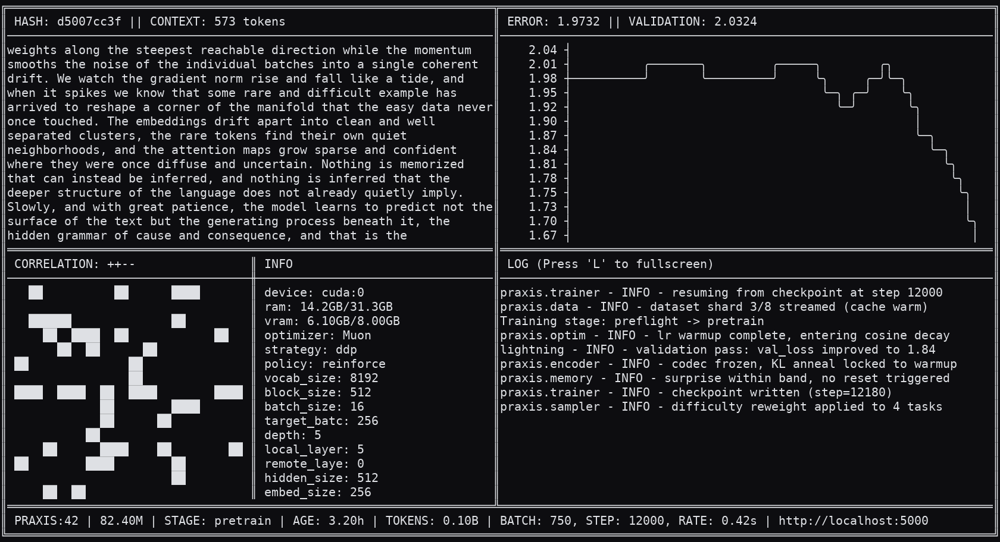
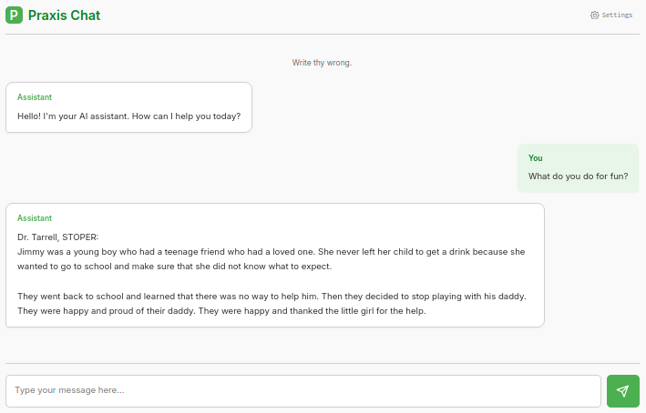

# praxis

_Praxis is the process by which a theory, lesson, or skill is enacted, embodied, realized, applied, or put into practice._

---



---

## description

The Praxis platform is an ever-evolving, local-first, peer-to-peer, burstable, flexible, modular, extensible and decentralized framework for the practice of [computational alchemy](https://www.reddit.com/r/MachineLearning/comments/1b6ggpz/comment/ktc2ujd). We are building a multi-modal fleet of AI agents that are small and simple, easy to parallelize, fault-tolerant, portable, and performant at any scale. We will achieve this via identity-weighted multipath routing, symbolic decision-making and prayer (asynchronous).

<details>

<summary>features</summary>

<!-- AUTODOC:FEATURES:BEGIN -->

Praxis is organized as ~20 pluggable registries. Each category below
links to a docs page listing the concrete implementations and their
source. See [docs/index.md](docs/index.md) for the full map.

- [Activation functions](docs/activations.md) (33)
- [Attention mechanisms](docs/attention.md) (7)
- [Block-stacking decoders](docs/decoders.md) (4)
- [Data sampler strategies](docs/data.md) (5)
- [Decoder block layouts](docs/blocks.md) (9)
- [Feedforward experts](docs/dense.md) (7)
- [Halting / early exit](docs/halting.md) (2)
- [Input encoders](docs/encoders.md) (10)
- [Layer-routing controllers](docs/controllers.md) (8)
- [Long-term memory](docs/memory.md) (4)
- [Loss functions](docs/losses.md) (9)
- [Normalization layers](docs/normalization.md) (5)
- [Optimizer profiles](docs/optimizers.md) (5)
- [Optimizer wrappers](docs/wrappers.md) (8)
- [Output heads](docs/heads.md) (9)
- [Positional encoding](docs/encoding.md) (5)
- [Recurrent cells](docs/recurrent.md) (2)
- [Residual connections](docs/residuals.md) (2)
- [RL policies](docs/policies.md) (6)
- [Sequence compression](docs/compression.md) (3)
- [Sequence sorting](docs/sorting.md) (5)
- [Token embeddings](docs/embeddings.md) (13)
- [Token routers](docs/routers.md) (11)
- [Training strategies](docs/strategies.md) (4)

<!-- AUTODOC:FEATURES:END -->

</details>

<details>

<summary>layout</summary>

<!-- AUTODOC:LAYOUT:BEGIN -->

Top-level directories, with detail sourced from each one's README
where present.

- **[`axis/`](axis/README.md)** - Axis is a mobile companion app for controlling Praxis, built with [Godot](https://godotengine.org/) 4.3. It is an older, archived experiment: the app still runs, but the model-prompting flow almost certainly no longer talks to the current Praxis API.
- **[`docs/`](docs/)** - Auto-generated per-registry docs. Regenerated at every launch.
- **[`environments/`](environments/README.md)** - Environment configurations override all other settings (defaults, experiments, and CLI args) to provide controlled presets for different use cases.
- **[`evaluation/`](evaluation/)** - Evaluation harnesses and helpers.
- **[`experiments/`](experiments/README.md)** - This directory contains experiment configurations for Praxis. Each `.yml` file defines a preset combination of CLI arguments.
- **[`integrations/`](integrations/README.md)** - This directory contains optional integrations that extend Praxis with additional functionality. Each integration is self-contained and can be automatically loaded based on CLI flags or conditions.
- **[`next/`](next/)** - Long-form research notes, exploratory writing, and the project [roadmap](next/roadmap.md).
- **[`praxis/`](praxis/)** - The model framework itself. See [docs/index.md](docs/index.md) for the per-registry feature map.
- **[`proofs/`](proofs/)** - Math / derivation notes backing the more unusual designs (harmonic head, ghostmax).
- **[`research/`](research/)** - The research paper, in LaTeX.
- **[`staging/`](staging/README.md)** - Welcome to the junkyard! This is where we dump experimental code that doesn't belong in core Praxis.
- **[`static/`](static/)** - Images used in the README and the web dashboard.
- **[`tests/`](tests/)** - Unit tests. Run with ``pytest tests -x``.
- **[`tools/`](tools/README.md)** - A shared toolbox of small CLI utilities, callable directly by both the human and the assistant (and, eventually, by Praxis models at inference time) so neither side has to relay numbers off charts or read/copy/paste data between contexts. Each tool is single-purpose and runs as `python ...

<!-- AUTODOC:LAYOUT:END -->

</details>

<details>

<summary>subsystems</summary>

<!-- AUTODOC:SUBSYSTEMS:BEGIN -->

Standalone subsystems, documented outside the registry map.

- [CLI arguments](docs/cli.md) - every `./launch` flag, grouped as in `--help`.
- [Web stack](docs/web.md) - dashboard, JSON API routes, and inference endpoints.
- [Axis mobile app](axis/README.md) - archived Godot companion app for controlling Praxis.

<!-- AUTODOC:SUBSYSTEMS:END -->

</details>

<details>

<summary>installation, configuration, and usage</summary>

## commands

The launch script will automatically manage the virtual environment. To start, simply run:

```sh
./launch
```

To view all supported command-line arguments:

```sh
./launch --help
```

Every flag is also catalogued in [docs/cli.md](docs/cli.md), auto-generated from the parser on each launch.

For development with quick iteration:

```sh
./launch --dev --no-dashboard
```

To run inside Docker (auto-detects ARM vs x86_64; forwards all subsequent flags):

```sh
./launch compose --alpha
```

To tear a running compose stack back down:

```sh
./launch stop
```

To run unit testing (accepts pytest arguments):

```sh
./launch test -x
```

## recommendations

We recommend you use a `batch-size` of at least 16, if possible. We have implemented an oversampling mechanism, which periodically multiplies your sequence length, and scales quadratically with batch sizes of 1, 4, 16, 64, etc.

We also recommend using an Nvidia GPU.

```sh
./launch --batch-size 16 --device cuda
```

To apply [alpha](experiments/alpha.yml) settings to your [experiment](experiments/README.md):

```sh
./launch --alpha
```

To apply [dev](environments/dev.yml) settings within your [environment](environments/README.md), with device overrides:

```sh
./launch --alpha --dev --device cuda:8 --quiet
```

</details>

<details>

<summary>showcase</summary>

## web stack

The dashboard and chat interface live at <http://localhost:2100>, backed by a JSON API for inference, metrics, and run management. See [docs/web.md](docs/web.md) for the architecture, the full route table (auto-generated from the live Flask app), and Python examples for the `/input` and `/messages` endpoints.



## mobile app

[Axis](./axis/README.md) is an older Godot mobile app for controlling Praxis. It still runs, though the model-prompting likely no longer works - see its [README](./axis/README.md) for details.

## to register with transformers

```py
from transformers import AutoConfig, AutoModel, AutoModelForCausalLM, AutoTokenizer
from praxis import PraxisConfig, PraxisForCausalLM, PraxisModel

AutoConfig.register("praxis", PraxisConfig)
AutoModel.register(PraxisConfig, PraxisModel)
AutoModelForCausalLM.register(PraxisConfig, PraxisForCausalLM)

config = PraxisConfig(
    embed_size=512,
    hidden_size=384,
    depth=6,
    num_heads=8,
    device_map="cuda:0",
)

tokenizer_model = "UNSAFE/praxis-4096"
tokenizer = AutoTokenizer.from_pretrained(tokenizer_model)

model = AutoModelForCausalLM.from_config(config)

input_ids = tokenizer.encode("The quick brown fox ")

outputs = model.generate(input_ids, do_sample=True)

print(self.tokenizer.decode(outputs[0], skip_special_tokens=True))
# --> The quick brown fox jumped over a lazy dog.
```

</details>

<details open>

<summary>won't do</summary>

- cryptocurrency

</details>

<details open>

<summary>community</summary>

- [Demo](https://arc.src.eco)
- [Discord](https://discord.gg/bp3SuFae5M)
- [Youtube](https://youtube.com/@The-Arc)
- [The Source](https://src.eco)

</details>

## limitations

- You will quickly run into rate limits with the Huggingface Datasets API. This is because anonymous users tend to be bots, and are subjected to severe restrictions. To alleviate this problem, you can install [huggingface-cli](https://huggingface.co/docs/huggingface_hub/en/guides/cli), and authenticate with a real user account. Praxis will use this user automatically.
