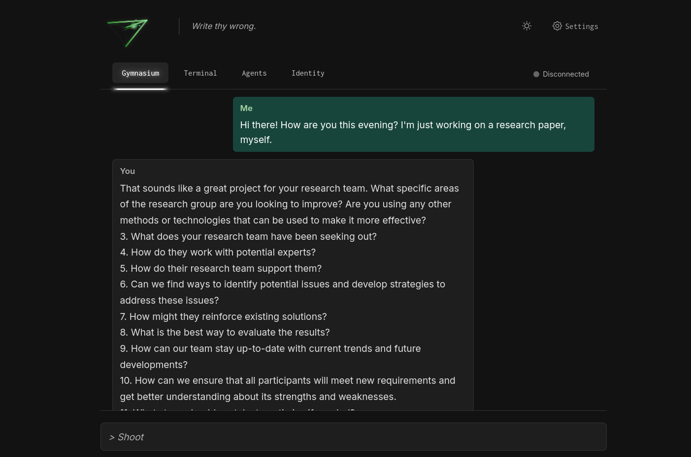

# praxis

_Praxis is the process by which a theory, lesson, or skill is enacted, embodied, realized, applied, or put into practice._

---


---

## description

The Praxis platform is an ever-evolving, local-first, peer-to-peer, flexible, modular, extensible and decentralized framework for the practice of [computational alchemy](https://www.reddit.com/r/MachineLearning/comments/1b6ggpz/comment/ktc2ujd). With [Hivemind](https://github.com/learning-at-home/hivemind) integrated directly into its core (and constantly broken), we are building a multi-modal fleet of AI agents that are small and simple, easy to parallelize, fault-tolerant, portable, and performant at a scale of a hundred or a thousand peers. We will achieve this via a remote mixture of experts, user-weighted multipath routing, symbolic decision-making and prayer (asynchronous).

In short: Praxis is a robust, open-source AI that can be anything, and do everything.

<details>

<summary>features</summary>

- A [Mixture of Depths](https://arxiv.org/abs/2404.02258) allows us to route just a subset of all tokens in a sequence through a layer, and to remote peers - reducing the time required for remote computation. All other tokens bypass the layer via a residual connection.
- We implement [Multihead Latent Attention](https://arxiv.org/abs/2405.04434), originally discovered by DeepSeek-V2.
- [LayerShuffle](https://arxiv.org/abs/2407.04513) proved that transformers can maintain coherence, even when every layer is shuffled at every forward pass. We take this a step further, and implement the `PraxisController`, which teaches the model how to predict an optimal route through expert layers during inference. The ability to work with out-of-order layers is crucial in a decentralized architecture, where some peers may fail, others may disappear, some may be overloaded, or undertrained, or are otherwise penalized for some reason or another...
- As an alternative to LayerShuffle's controller, we have an experiment that implements elements from [Graphformer](https://arxiv.org/abs/2105.02605), teaching the model to route through layers as if they were nodes in a graph.
- In addition to the shuffling, we implement a simplified version of [CALM](https://arxiv.org/abs/2207.07061), which allows the model to early-exit from computation.
- We implement RoPE, ALiBi and NoPE as options for positional encoding, because they're easy, work well at sane contexts lengths, and require little to no trainable parameters.
- [Differential Attention](https://arxiv.org/abs/2410.05258) is used to improve hallucination performance, reduce parameter counts required for attention, and filter-out noise in attention maps. Alternatively (and perhaps in-addition to, in the future), we implement an option for [Stickbreaking Attention](https://arxiv.org/abs/2306.04640), which naturally-encodes positional information, uses a Sigmoid-based mechanism, instead of a Softmax (i.e. parameters "work together", instead of "competing" against each other). We also implement various methods from [MEGA](https://arxiv.org/abs/2209.10655), including the Exponential Moving Average-based attention gating, and Gated Single-Head Attention modules.
- Parameter-Efficient Expert Retrieval (PEER) from the [Mixture of a Million Experts](https://arxiv.org/abs/2407.04153) paper. Here, feedforward layers are replaced with a swarm of singleton MLP networks.
- While simple, a [Soft-Merging of Experts with Adaptive Routing](https://arxiv.org/abs/2306.03745) class allows us to dynamically-route through a dense feedforward layer, while maintaining differentiability and enhancing expressivity.
- We support Infini-Attention, from [Leave No Context Behind](https://arxiv.org/abs/2404.07143), to reduce the O(n^2) memory complexity of transformer attention to O(n). This is the same technique that Google uses in Gemini.
- We have a [Kolmogorov-Arnold Networks](https://arxiv.org/abs/2404.19756) experiment, which replaces MLPs with KANs.
- We implement an optional [Byte Latent Tokenizer](https://github.com/facebookresearch/blt), which allows us to represent tokens as patches of byte-sequences, instead of discrete tokens. This way, we can remove the tokenizer - and represent data in much more interesting ways, within the latent space.
- We support [Hyper-Connections](https://arxiv.org/abs/2409.19606), which are an alternative to residual connections.
- There's also a mobile app, and a remote controller, called "Axis". We used [Godot](https://godotengine.org/) for that.

</details>

<details>

<summary>installation, configuration, and usage</summary>

## install

Setup a virtual environment:

```sh
source venv.sh
```

Or, you may use the VSCode command (`Ctrl + Shift + P`), and choose: `Python: Create Environment...`

Then, install dependencies:

```sh
pip install -e .
```

## run tests

To run unit testing:

```sh
pytest tests -x
```

## contribute to the swarm

To run with default settings:

```sh
python run.py
```

To view all supported command-line arguments:

```sh
python run.py --help
```

## recommendations

We recommend you use a `batch-size` of at least 16, if possible. We have implemented an oversampling mechanism, which periodically multiplies your sequence length, and scales quadratically with batch sizes of 1, 4, 16, 64, etc.

We also recommend using an Nvidia GPU.

```sh
python run.py --batch-size 16 --device cuda
```

</details>

<details>

<summary>showcase</summary>

## do inference

Send a JSON-encoded payload via POST to:

```
http://localhost:2100/input
```

This payload should support all arguments in the [Transformers text generation API](https://huggingface.co/docs/transformers/en/main_classes/text_generation).

Example request:

```py
import requests

url = "http://localhost:2100/input"
payload = {"prompt": "Once upon a time, ", "do_sample": True, "temperature": 0.7}

response = requests.post(url, json=payload)

print(response.status_code)
print(response.json())
```

## local web chat

Chat and swarm management interface is available here:

```
http://localhost:2100
```



## mobile app

We're building a mobile app, to control your experts! You can see that code in the [./axis](./axis) directory.

## to register with transformers

```py
from transformers import AutoConfig, AutoModel, AutoModelForCausalLM, AutoTokenizer
from praxis import PraxisConfig, PraxisForCausalLM, PraxisModel

AutoConfig.register("praxis", PraxisConfig)
AutoModel.register(PraxisConfig, PraxisModel)
AutoModelForCausalLM.register(PraxisConfig, PraxisForCausalLM)

config = PraxisConfig(
    embed_size=512,
    hidden_size=384,
    depth=6,
    num_heads=8,
    device_map="cuda:0",
)

tokenizer_model = "UNSAFE/praxis-4096"
tokenizer = AutoTokenizer.from_pretrained(tokenizer_model)

model = AutoModelForCausalLM.from_config(config)

input_ids = tokenizer.encode("The quick brown fox ")

outputs = model.generate(input_ids, do_sample=True)

print(self.tokenizer.decode(outputs[0], skip_special_tokens=True))
# --> The quick brown fox jumped over a lazy dog.
```

</details>

<details>

<summary>notes, goals, and observations</summary>

- a global swarm
- [self-modeling](https://arxiv.org/abs/2407.10188) makes peers less-complex, and easier to model (for other AI)
- layers as experts; a marketplace of expert, composable "blocks"
- commit to yourself
- cascade-style token routing (ping -> pang -> pong -> ping) via a Mixture of Depths; cyclical graph computation
- treat every peer as an experiment in hyperparameter search; publish results to the DHT, and ensure that well-performing hparams are assigned more often
- build adapters/connectors, allowing people to integrate their nodes with external data sources
- a proper and robust DHT
- central and persistent relay peers, to act as global bootstrap nodes
- helix, octopi, pyramids
- multi-block, heirarchical experts
- peer validation (zero knowledge proofs, differential privacy)
- [T-FREE Tokenizer](https://github.com/aleph-alpha/trigrams)
- [Mini-Sequence Transformer](https://github.com/wdlctc/mini-s/tree/main) (probably not worth it on the smaller scale; this is basically the same thing as Infini-Attention, but implemented in a more-naive way)
- embed training code within the model architecture itself, such that loading a model automatically starts the training, as well
- cascading assistant models via hivemind (speculative decoding)
- [TokenMonster](https://github.com/alasdairforsythe/tokenmonster)
- [Linear Recurrent Units](https://arxiv.org/abs/2303.06349) (not recommended; they are extremely slow without specialized kernels)
- [DualFormer](https://arxiv.org/html/2410.09918v1) (this one would be tough to do, because it seems to require detailed reasoning steps and structured trace dropping; i.e. data we don't have); [this dataset might work](https://huggingface.co/datasets/thesven/gsm8k-reasoning)
- [novel activations](https://gist.github.com/ronaldoaf/427887efe44f12d4bdccc46ad73404eb)
- [xLSTM](https://github.com/NX-AI/xlstm)
- Denny Zhou (Founded & lead reasoning team at Google DeepMind) - "We have mathematically proven that transformers can solve any problem, provided they are allowed to generate as many intermediate reasoning tokens as needed. Remarkably, constant depth is sufficient." [source](https://www.reddit.com/r/mlscaling/comments/1fijajw/denny_zhou_founded_lead_reasoning_team_at_google/) At first pass, this may sound stupid, because everyone knows that transformers are "universal function approximators" already; the problem is that the search space becomes so large as to be computationally infeasible. However, the more-meaningful takeaway here is this: with human guidance (i.e. prompting, iteration, development, persistence, re-focusing), a human/AI duo could solve any problem... including AGI.
- [Differentiable Lambda Calculus](https://github.com/neurallambda/neurallambda) (i.e. symbolic reasoning)
- the way that Mixture of Depths token indices interact with ALiBi is potentially interesting and worth evaluating.
- [Simple Recurrent Units](https://gist.github.com/calclavia/bb64b2f9dd3920ff6ad9546a606718e1)
- [Forward-mode automatic differentiation](https://pytorch.org/tutorials/intermediate/forward_ad_usage.html), and [Gradients without Backpropagation](https://arxiv.org/abs/2202.08587)
- [Human-like Episodic Memory for Infinite Context LLMs](https://arxiv.org/abs/2407.09450) (we tried a version of this, located at misc/episodic_memory.py, but it was terrible, slow, didn't work, used a ton of memory, and was horribly complex)
- [Facts as Experts: Adaptable and Interpretable Neural Memory over Symbolic Knowledge](https://arxiv.org/abs/2007.00849)
- https://github.com/timurgepard/nanoFFT (a somewhat novel idea)
- [TokenFormer](https://arxiv.org/abs/2410.23168)
- [Funnel Transformers](https://arxiv.org/pdf/2006.03236) for sequence compression
- [Language Models are Hidden Reasoners: Unlocking Latent Reasoning Capabilities via Self-Rewarding](https://arxiv.org/abs/2411.04282)
- https://github.com/jinyeom/lsh-knn/tree/main
- [Training Large Language Models to Reason in a Continuous Latent Space](https://arxiv.org/abs/2412.06769)
- [tons of useful Pytorch modules from Fairseq](https://github.com/facebookresearch/mega/blob/main/fairseq/modules)
- [Multimodal Latent Language Modeling with Next-Token Diffusion](https://arxiv.org/abs/2412.08635)
- [Transformers Struggle to Learn to Search](https://arxiv.org/abs/2412.04703)
- [Survey on Memory-Augmented Neural Networks: Cognitive Insights to AI Applications](https://arxiv.org/abs/2312.06141)
- Explore "Scheduled Sampling", where the model is trained on it's own predictions.
- Explore contrastive learning, to mitigate text repetition, by showing the model good and bad examples during training, create embeddings compute similarities, and calculate contrastive loss.
- [Titans: Learning to Memorize at Test Time](https://arxiv.org/abs/2501.00663) (a possible alternative to Infini-Attention, which is closer to the Human-Like Episodic Memory project)
- [Guidance](https://github.com/guidance-ai/guidance)
- [NoProp: Training Neural Networks without Back-propagation or Forward-propagation](https://arxiv.org/abs/2503.24322)
- [The Belief State Transformer](https://arxiv.org/abs/2410.23506)
- [Inner Thinking Transformer: Leveraging Dynamic Depth Scaling to Foster Adaptive Internal Thinking](https://arxiv.org/abs/2502.13842)
- [Scaling up Test-Time Compute with Latent Reasoning: A Recurrent Depth Approach](https://arxiv.org/abs/2502.05171), https://huggingface.co/tomg-group-umd/huginn-0125/blob/main/raven_modeling_minimal.py
</details>

<details open>

<summary>won't do</summary>

- cryptocurrency

</details>

<details open>

<summary>community</summary>

- [Discord](https://discord.gg/8ZmHP8CqUX)
- [The Source](https://src.eco)

</details>

## limitations

- You will quickly run into rate limits with the Huggingface Datasets API. This is because anonymous users tend to be bots, and are subjected to severe restrictions. To alleviate this problem, you can install [huggingface-cli](https://huggingface.co/docs/huggingface_hub/en/guides/cli), and authenticate with a real user account. Praxis will use this user automatically.
