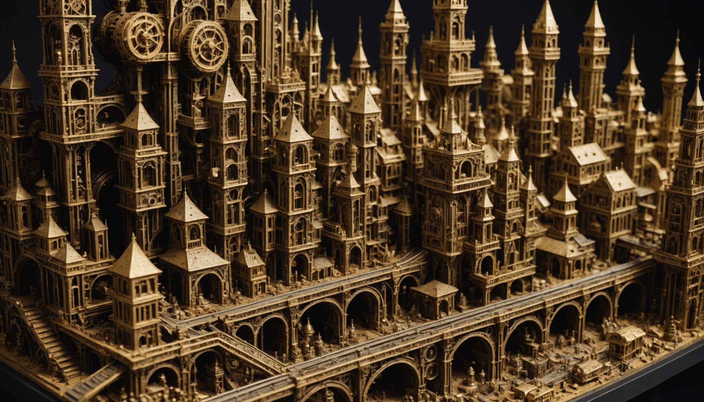

# ghost

A spectral audio visualizer built with [Godot](https://godotengine.org/) 4.6 - _spectral_ both ways: it draws from the audio **spectrum**, and the things it conjures (drifting fog, falling snow, fireflies, auroras) haunt the frame like apparitions. Point it at a `.wav`, and it draws geometry in response to the sound - rings, planes, harmonics, lattices, weather, whatever - then loops through scenes like a video you can record full-screen.

It is the same move as the Arena and business-card generators elsewhere in this repo, pushed at audio: a **scene definition** (a typed bag of parameters) is passed through **typed transformations** that are modulated by audio features - amplitude, per-band energy, beat, velocity. Procedural, deterministic, and cheap. No generative AI in the render path.

## Why

Generating visuals for a song with an image/video model is slow and expensive. A procedural visualizer is free, runs in real time, and is infinitely customizable. The show is **spectrally deterministic**: the session seed is derived from the audio's own fingerprint, so the _same song always produces the same imagery_ - the visuals are a function of the sound, not a fresh random roll. `--seed N` overrides it (the exporter passes it so a render reproduces a session, and it is how you deliberately roll a _different_ show for the same song).

## The idea: cattle, not pets

Most 3D work treats each object as a **pet**: you hand-model _this_ eye, _this_ rock - name it, tune it, love it. It doesn't scale and it never surprises you. ghost is built the other way - **cattle**: an object is a _recipe_ of layered primitives whose parameters are **sampled from adjustable ranges**, so every instance is a fresh, naturally-occurring variation.

The discipline, taken to its limit: **every tunable constant is a candidate for sampling.** Wherever a number could be perturbed and the geometry / animation / shading would still read right, it should be drawn from an intelligent range (per instance, around a sensible centre) rather than baked as one value - so two things of a kind still differ, and the visualizer gains expression for free. `rocks` is the worked example: not one material per style, but a material _sampled per rock_; not a reveal flag, but a reveal _threshold sampled across a spectrum_.

Take **the eye** (`EyeBody`) as the worked example. A pet eye is a bespoke mesh. But an eye is _really_ just a few primitives stacked: a **sphere** for the ball, a thin pliable **lens** (a cornea dome) stretched across the front, a recessed **iris** cap, a **pupil** hole - plus colours, hues, gloss, and a light. Model _those layers_ and _sample their ranges_ - iris hue and saturation, pupil dilation, corneal curvature and gloss, eyeball size, how restless the gaze is - and you don't get one eye, you get the _space of all eyes_, occurring naturally. (Today's `EyeBody` is the first step: the layers are real 3D primitives, but several of their numbers are still hand-tuned. Lifting those into sampled ranges - turning the pet into cattle - is the [scene-spec pipeline](#roadmap) north star.) The same move is already in `rocks` (a sampled stack of geometry + texture + material) and `bloom` (a whole family of shapes from a handful of superformula numbers).

### Three ways to drive it

1. **Auto** - the autopilot. The session seed - derived from the song's own audio fingerprint - rolls the whole show; the Director picks scenes by novelty and cuts on the music. **Spectrally deterministic**: the same song always plays the same show (a different song, a different one), so the imagery belongs to the sound. `--seed N` overrides it to roll a fresh variant on purpose.
2. **Manual** - a **storyboard**. You author the exact sequence and cues by hand (`storyboards/*.json`), the way "the-point" lays out eye → two_eyes → prism. Every pet placed deliberately.
3. **Semi-automatic** _(planned - the one to be excited about)_. Start from the **same autopilot seed**, then reach in and **pull levers, turn dials, move sliders** that influence the modulation at chosen points - nudge iris hue, gaze energy, how hard the beat splits the prisms - and watch the downstream scenes change in response, live. Not keyframing; _steering a living system_. The seed hands you a whole world for free; the controls bend it toward what you hear. The aim is for it to feel fast, responsive, and unlike anything you've used.

## The shape

```
  .wav ──▶ Spectrum ──▶ AudioFeatures ──▶ GhostScene ──▶ screen / video
           (analyzer)    (typed, per-frame)  │  (definition × behavior)
                                  movement ──┤
                                             ▼
                              Director: cut on the music, blend sometimes
```

- **`Spectrum`** (autoload) owns the `AudioStreamPlayer` and the `AudioEffectSpectrumAnalyzer` bus effect. Every frame it emits one **`AudioFeatures`**: overall `energy`, named bands (`bass`, `low_mid`, `mid`, `high`, `treble`), a smoothed `beat` pulse, the full `bands` array, `time`, and - new - `flux` and `movement` (a sliding-window measure of how much the spectrum is _changing_, used to time scene cuts). This is the single typed interface every scene reads - scenes never touch the audio engine directly.
- **`GhostScene`** (`class_name`, base script) is one visualizer. `build_params(rng)` rolls a **definition** from a seeded RNG (the typed parameter bag), `update(features, delta)` modulates that definition by the audio, and `_draw()` renders it through the scene's **view** (a centered camera: zoom / tilt / rotate / off-center). Add a scene by subclassing this.
- **Motion is its own axis.** _What_ a scene draws (the definition) is separate from _how it moves_ (a **behavior**). The base provides a **`ModBank`** of slow seeded oscillators pooled into named organic channels (`mod.value("sway")`) and a per-element `wobble(key, i)` offset.
- **Physics is a registry, not per-scene code.** The duplicated dynamics (scatter, gravity, springs) are extracted into **`Primitives`** - a registry of reusable **force** modules (`gravity`, `spring`, `drag`, `scatter`, `wind`, `pulse`, `orbit`, `wobble`), each a small class with constants baked in via its config, the Praxis registry move. A scene builds a **`ParticleSystem`** (a bag of `Particle`s = geometry) and **composes forces by key**; the substrate steps them and reports `settled()` for oneshots. The same `scatter` bursts glass, rocks, and embers - cross-contamination is free, and a new scene is mostly a parts list (see `embers`).
- **Appearance is a registry too - the integration axis.** `Primitives` composes _physics_; **`Layer`** composes _appearance_ - the visual sibling registry. A **layer** is a self-contained visual component that seeds itself, advances on the audio, and draws itself onto the scene's canvas: `bed` (a colour wash with breathing pools), `fog` (rolling banks), `snow` (falling flakes, with procedural six-fold dendrites for the near ones), `rain`, `fireflies`, `stars` (twinkle + shooting stars), `aurora` (flowing curtains), `petals`, `dust` (motes in a light shaft), `bubbles`, `embers`. Any scene composes them through `add_layer(key, rng, cfg)` / `update_layers` / `draw_layers(z)` on the base. **This is the missing integration**: the same `snow` that is a scene on its own (`snowfall`) also falls over the `cityscape` skyline and the `gaussian_landscape` hills (stars drawn `z = "back"` behind the geometry, snow `"front"` over it) - weather is a component, not bespoke per-scene code. Layers draw in unit-fraction space and are handed the visible half-extents each frame, so they fill any aspect / fullscreen / 4K without baring an edge.
- **Behaviors** (`static` / `drift` / `fluid`) are typed presets of motion gain. `static` freezes the camera and per-element motion - the scene reacts to audio alone (the original, un-modulated look). `drift` adds gentle whole-scene camera breathing. `fluid` turns on independent per-element motion. The same geometry, kept as several options. Determinism is preserved: same song, same behaviors, every run.
- **Structure is the bias; motion is bounded variance** - for _flat_ things. A flat subject (snowflake, glass pane) sways about a seeded rest pose rather than spinning, and the camera never rolls or shears flat 2D content (rolling/shearing a plane is fake 3D - `drift_view` does only zoom + pan). Genuinely 3D bodies (`Mesh3D`) are the exception: they rotate slowly and continuously, because that is how a real solid reveals its volume. **`Activation`** carries the same idea to elements: each gets a seeded threshold + gain through a soft nonlinearity and a fast-attack/slow-decay EMA, so with `sparsity > 0` some elements stay rooted (the static floor) while others bloom; `sparsity = 0` means everything moves. And the **camera eases** (the `SceneView` EMA-smooths toward its target), so every move is gentle.
- **Every scene declares its render kind.** The project has carried several rendering mechanisms forward (the "split"), so each scene now names _how_ it draws on a typed axis - `canvas` (flat 2D), `mesh3d` (software 3D bodies projected onto the canvas), `particles`, `swarm`, or `scene3d` (the unified path below). Naming the divergence is the first step to converging on it; the kind rides along in every feedback record so a critique is tied to the renderer that produced it.
- **Real 3D where it matters.** `Mesh3D` is a software 3D primitive (icosphere / cube / octahedron / tetrahedron → depth-sorted flat-shaded faces). `Geo` holds the shared polygon helpers (convex split, fracture) that shatter the glass.
- **A unified 3D path (`scene3d`), the convergence target.** A real, positionable perspective camera (`Lens3D`: an eye looking at a target with a field of view) replaces the old fixed centred projector - so a scene can push in, orbit, and frame _in depth_, and a wide lens up close gives **forced perspective** (near geometry looms over far, the dimensional read a sheared 2D plane only fakes). `Plane3D` is a flat quad genuinely placed in 3D space (stack them for parallax, stand them as bars, tilt them into depth - geometry, not a sheared card). `Scene3D` is the base that owns the lens and a world of `Mesh3D` bodies + `Plane3D` quads, depth-sorts the lot back-to-front, and draws it - so bodies and planes correctly occlude each other under one camera. `wire_solid` is migrated onto it and `planes` is built on it; the rest migrate here over time.
- **Many items, local rules.** `Swarm` is a scalar field over a grid that evolves by _local_ interaction - development creeping out from seeds (`GROW`), or injected pulses diffusing across the lattice (`WAVE`). It drives thousands of items without scripting each one (the `metropolis` city grows and pulses from one), and the same mechanism transfers to any abstract many-item grid - the cellular / ant-colony idea.
- **Sound drives colour, not scale.** Pulsing geometry _size_ with amplitude reads as cheap throbbing - shapes hold their form. Instead, audio drives **colour, brightness, and glow** through `Lighting`: moving bright **hotspots** that sweep the frame (region-aware lighting / gradient swipes), a global **glow** that flares on beats and decays slowly, and a slow hue drift. A scene asks `light.at(pos)` for a local brightness boost and `light.glow()` for the global flare. This is the shared modulation surface a future unified renderer (2D or 3D under one control) will route everything through; for now scenes opt in.
- **Framing is a typed axis.** A scene declares a `framing` class and the **`Shots`** registry assigns a camera move from the matching pool: expressive for `subject` (offset / push / pan / canted), gentle for `field` fillers, square-on for a single `plane` (so a flat snowflake or pane never reads as a tumbling card). And planes can spawn in multiples - a few small ones don't look stranded the way one lone spinning plane does.
- **Lifecycle and exit cues are typed too.** A scene either **loops** until cut, or is a **oneshot** that plays one sequence and reports `finished()` (shatter glass settling, then ending). Once a scene is _eligible_ to exit - a loop past its minimum hold, or a oneshot that finished - the **`Director`** waits for a chosen spectral **trigger** before actually cutting, so exits land on the music: usually a **beat** (rising edge), sometimes a **movement** (section change) or a **lull** (drop into quiet), with a maximum-hold backstop. Triggers are picked weighted per scene.
- **`Director`** (autoload) holds the registry of `{scene, behavior}` pairs, runs the lifecycle/trigger logic above, and performs the change. In auto mode it mostly **dips to black** (the old scene fades out, a beat of true darkness, then the new one fades up) with the occasional hard **cut**; a storyboard sets its own style (the-point forces 100% **cuts**). `--scene <name|N>` pins one scene for authoring.
- **Transition style is a hierarchy.** Highest wins: a compatible **morph** (below) → the storyboard **entry**'s `transition` → the **scene**'s own `transition_style` (set in build_params) → the storyboard's top-level default → the mode default (manual = `cut`, auto = the weighted dip/cut bag). So a storyboard can force "cut" for everything yet a single scene can still ask for a dip, and the-point gets 100% cuts except where a morph applies.
- **Content-aware transitions (typed morphs).** A scene declares the geometry it leaves (`morph_out`) and what it can grow in from (`morph_in`). When the next scene's `morph_in` matches the current scene's `morph_out`, the Director plays a **morph** - an instant swap where the incoming scene animates out of the outgoing shape - instead of a cut/dip, and hands over a typed `morph_payload()` so the transition is _continuous_: the single eye passes its colour/gaze/size to `two_eyes`, which starts as that exact eye and splits into two identical copies. Mismatched or empty types fall back to a cut, so a bespoke transition is only ever attempted between compatible geometries - it can't break.
- **Novelty-weighted scheduling.** Picking the next scene uniformly at random clusters - the same _kind_ recurs while others go unseen. Instead each candidate is weighted by how long its kind has gone unshown, so long-unseen scenes are drawn far more often than recent duplicates (and never two of one kind back to back). A soft priority queue - seeded by the session seed (the audio fingerprint by default, so it is the same for a given song; `--seed N` to override).
- **Ways to drive the show** (see [Three ways to drive it](#three-ways-to-drive-it)). _Auto_: the Director chooses scenes by novelty and cuts on the music. _Manual_: plays a **storyboard** - a user-authored linear sequence (`storyboards/*.json`), each entry naming its scene, behavior, shot, and exit rule (a fixed `hold`, a musical `beat`/`movement`/`lull` cue, or the scene's own lifecycle); see `storyboards/README.md`. _Semi-automatic_ (planned): the autopilot seed plus live levers/dials that steer the modulation. The storyboard is the first rung; the data spec grows toward a manual editor and then the semi-auto control surface.
- **A feedback channel for authoring.** "This shape feels wrong" is hard to act on from a note; the `FeedbackConsole` (press `` ` ``) captures the scene on screen - its typed descriptor (name / kind / behavior / shot / seed / params / the audio frame) plus your typed query _and a screenshot_ - into `feedback/NNNN.{json,png}`. The seed makes it reproducible; the image shows what "wrong" looked like.
- **`Splash`** is the start screen: import a song from disk (the last one is remembered in `user://ghost.cfg` and pre-selected), then click **Auto** (start the scheduler) or **Manual** (open the workspace) - the mode button _is_ start, there is no separate one. CLI flags (`--audio` / `--scene` / `--storyboard` / `--no-splash`) boot straight past it for authoring and automation.
- **`Workspace`** is the manual-mode surface (scaffolding): opened by the Manual button over a session running `storyboards/default.json`, a left-side panel lists the storyboards and clicking one switches the live show to it. This is the canvas the future hand-authoring tools (per-entry params, reordering, a timeline, save) will grow into.
- **Session lifecycle.** `main` owns it: splash → start a session (Auto or Manual) → and **when the song ends, tear the session down and return to the splash** (`Spectrum.song_finished` → `Director.detach()` + `Spectrum.stop()`). It also maps the global keys (next / full-screen / feedback / quit).

## Rendering: live & baked

(Distinct from the three _driving_ modes above - this is how frames get produced.)

1. **Live (default).** Audio plays through the analyzer bus; scenes react in real time. Use this to author and preview, and screen-record it with OBS for a quick capture. The window stretches in **`canvas_items`** mode, so 2D is rasterized at the monitor's native resolution (`F11` fullscreen is crisp, not an upscale of the 1080p base) while the coordinate system scales _proportionally_ - UI and scene content keep their relative size and snap back exactly when the window returns to its original size. The export overrides this with an offscreen **`viewport`**-mode buffer so it can render above the physical display (true 4K on a 1080p monitor).
2. **Baked (for export).** The Export button first asks for a **quality** - **720p · 30 fps**, **1080p · 60 fps** (native), or **4K · 60 fps** (full resolution) - then runs two background processes: a **headless** `bake_runner` first analyzes the song into a spectrum timeline (`SpectrumBake`, cached per song), then a **Movie Maker** render (`--write-movie out.avi --fixed-fps <fps> --bake-file …`) loads that timeline and drives the scenes from it instead of the live analyzer - frame-perfect, with synced audio, and unaffected by the fact that Movie Maker's offline audio would otherwise make the live analyzer unreliable. Keeping the analysis out of the render means the render never blocks on a grey frame. The live authoring session keeps using the real-time analyzer. The chosen resolution is set via a transient **`override.cfg`** (the exporter writes it before the render and removes it after): Movie Maker locks its output resolution to the project's viewport size at engine startup, before any script can run, so `override.cfg` - which Godot reads from the project root at boot - is the only lever; it uses `viewport` stretch mode so the frames are an offscreen buffer of exactly that size, true 4K even on a 1080p display.

## Layout

- `project.godot` - Godot 4.6 project; autoloads `Boot` (hides the render window early in export mode), `Spectrum`, and `Director`; `main.tscn` is the entry scene.
- `scenes/main.tscn` / `scripts/main.gd` - root node; loads audio, full-screen (`F11`), next scene (`Space`), quit (`Esc`).
- `scripts/spectrum.gd` - `Spectrum` autoload: live analyzer + a baked-timeline backend (`--use-bake`), per-frame `AudioFeatures`, spectral-flux/movement detection, and the audio content `_fingerprint` that makes the show spectrally deterministic (`song_hash`).
- `scripts/bake.gd` - `SpectrumBake`: offline FFT of the song (via ffmpeg) into the same 64 log bands - the deterministic timeline the export render replays.
- `scripts/audio_features.gd` - `AudioFeatures`, the typed per-frame struct scenes consume.
- `scripts/ghost_scene.gd` - `GhostScene` base class: definition + view + behaviors + the `tick`/`drift_view`/`wobble` motion helpers.
- `scripts/mod_bank.gd` - `ModBank`, the seeded slow-oscillator pool behind organic motion.
- `scripts/activation.gd` - `Activation`, per-element sparse response gating with EMA decay.
- `scripts/scene_view.gd` - `SceneView`, the EMA-smoothed per-scene camera (zoom / tilt / rotate / off-center).
- `scripts/shots.gd` - `Shots`, the camera-framing registry (centered / offset / push / pull / pan / canted) with subject/field/plane pools.
- `scripts/particle.gd` / `scripts/primitives.gd` / `scripts/particle_system.gd` - the physics substrate: a `Particle`, the `Primitives` force **registry**, and the `ParticleSystem` that composes and steps them.
- `scripts/field.gd` / `scripts/palette.gd` / `scripts/terrain.gd` - the **terrain & texture foundation**. `Field` is the composable procedural-field primitive (the universal "texture / modulation"): a sampleable scalar built from a kind (fbm hills, ridged mountains, billow, worley `cells` for cracks, `strata` bands, gradient), domain-**warped**, pushed through a Nonlinear **curve**, and **combined** (add/mul/mask/max/min/sub) into a tree - the same field drives a mountain's height, a rock's mottle, or any spatial modulation. `Palette` maps a 0..1 scalar to colour (earth / alpine / desert / volcanic / alien / ocean ramps). `Terrain` composes `Field`s into a heightfield (sampled once - terrain is static), colours it by `Palette` + a surface-texture field + slope shading, pools water below a level, exposes `height_at` / `normal_world` for standing things on it, and draws the depth-sorted surface through a `Lens3D`.
- `scripts/layer.gd` - the `Layer` **registry** of reusable _visual_ components (the appearance sibling of `Primitives`): `bed` / `fog` / `snow` / `rain` / `fireflies` / `stars` / `aurora` / `petals` / `dust` / `bubbles` / `embers`, plus the procedural six-fold `draw_flake` dendrite. Any scene composes them via the `GhostScene` helpers, so weather is shared, not per-scene.
- `scripts/mesh3d.gd` / `scripts/geometry.gd` - the `Mesh3D` software-3D primitive (icosphere/cube/octa/tetra + `dome` caps; coherent fractal `warp`, planar `facet`, `texturize`, smooth/Gouraud shading via `compute_normals`, a material with `gloss`/`roughness` specular + an `unlit` option, and a `rock()` factory) and `Geo` polygon helpers (split, fracture).
- `scripts/lens3d.gd` / `scripts/plane3d.gd` / `scripts/scene3d.gd` - the unified 3D path: the `Lens3D` perspective camera, the `Plane3D` quad primitive, and the `Scene3D` base that depth-sorts bodies + planes under one camera.
- `scripts/feedback.gd` - the `FeedbackConsole` (press `` ` ``): writes a scene record + screenshot to `feedback/` for authoring.
- `scripts/splash.gd` - the `Splash` start screen: song import (remembered), Auto / Manual.
- `scripts/workspace.gd` - the `Workspace`: manual-mode left panel listing storyboards over the live scene (scaffolding for hand-authoring).
- `scripts/prism_body.gd` / `scripts/eye_body.gd` - the `PrismBody` (browser Prism ported: wireframe tetra + living neural core) and `EyeBody` (a floating eyeball with saccadic gaze), reused across the "the-point" scenes.
- `storyboards/` - user-authored scene scores for Manual mode; `default.json` is the "the-point" sequence (eye → prism → prism_split, exits on the music), `storyboards/README.md` is the data spec.
- `scripts/swarm.gd` - `Swarm`, the grid field that spreads by local rules (growth fronts, pulse waves) for many-item scenes.
- `scripts/lighting.gd` - `Lighting`, audio-reactive colour: moving hotspots, beat glow, hue drift (the preferred channel over scale).
- `scripts/nonlinear.gd` / `scripts/flow.gd` / `scripts/filament.gd` - the organic layer: `Nonlinear` (shared response curves + asymmetric `flare`), `Flow2D` (curl-noise meander field), `Filament` (root / tendril / lightning / thread growth that crawls in along a front).
- `scripts/exporter.gd` / `scripts/bake_runner.gd` - the `Exporter` (persistent) renders to video in **two background processes**: first a **headless** `bake_runner` analyzes the song into a spectrum cache (no window, cached per song), then a Movie Maker render loads that cache (`--bake-file`) and draws immediately - so the render never freezes baking. Both are polled by PID; status ("Analyzing… 45%" / "Rendering… 72%" / "Exported ✓") shows in the main window. The button fades in after ~30s of playback (or partway through a shorter song).
- `scripts/director.gd` - `Director` autoload: `{scene, behavior}` registry, lifecycle + spectral-trigger timing, cut/blend transitions, `--scene` pin, and the session seed (audio fingerprint by default, `--seed N` override).
- `scripts/scenes/` - the visualizers (see below). Drop new ones here and register them in `Director.SCENES`.
- `audio/` - put `song.wav` here (git-ignored). Or pass `--audio /path/to/song.wav` on launch.

## Scenes

Each is a small combination of shapes; behavior decides how it moves.

- **`spectrum_ring`** - the spectrum bent into a circle; bars push outward per band. At the core, by seed, either a shaded pseudo-sphere or a **real 3D human eye** (`EyeBody`, looking around through its own `Lens3D`). `static` (rigid wheel) and `fluid` (bars ripple as detached strokes).
- **`harmonic_lattice`** - a grid of cells breathing with a traveling spectral wave, under a **flowing hue map**: a diagonal hue gradient across the field plus a travelling wave the audio drives forward, with saturation variance, so the palette gradients across the grid and drifts over time rather than holding one colour. `static` and `drift`.
- **`rooted_growth`** - crawling roots and tendrils (`Filament`) that spread from a seed into trunk-and-limb structure, meandering on a curl-noise `Flow2D` field, branching and tapering, revealed along a growth front so they creep outward. Each root runs an **independent, staggered lifecycle** (slow grow → hold → retire), so growth is **asynchronous** - never uniform bands. Retirement is graceful, never a clear-and-pop: a root either **fades** out (alpha to zero) or **rewinds** by a **varied amount** - usually a _partial_ pull-back toward the seed that then re-extends the same root, only occasionally a full collapse + fresh path - so it isn't always delete-everything-and-restart. Growth speeds are drawn from a **normal distribution** (slow crawlers to fast shoots). Beats surge the growth (a nonlinear `spike`); colour and glow carry the audio; a **timelapse twitch** keeps trunks steady while young tips tremble.
- **`filaments`** - the `Filament` primitive showcased, three lives by seed: slow **lightning** (forked bolts that strike on the beat - and on a fallback cadence, so it never goes dark - blaze, fade, re-strike), **neural** tendrils, or flowing **threads**. The continuous (neural/thread) lives run the same staggered, always-growing lifecycle as `rooted_growth` - grow → hold → fade-or-rewind → regrow, asynchronous and pop-free.
- **`fog_lights`** - glowing orbs tied to slices of the spectrum, diffused and occluded under big drifting blobs of fog.
- **`strata`** - translucent waveform planes stacked into tilted depth, near planes scrolling faster than far (parallax).
- **`bloom`** - elegant procedural rosette curves from the superformula (a few numbers → star / flower / gear / soft polygon), layered concentrically with a hue gradient and morphing _continuously_ with the audio (energy sharpens the lobes through a nonlinear curve). Replaced the old hard-coded Koch stars, which stepped their recursion in visible jumps.
- **`wire_solid`** - a true 3D cube / octahedron / tetrahedron / icosahedron (`Mesh3D`): perspective, depth-sorted, translucent faces with bright edges. Rotates slowly and continuously, because a real solid reveals its volume by turning. By seed, faces flicker light **asynchronously** (each on its own phase/rate via `Mesh3D.face_glow`) instead of pulsing in unison. On the unified `scene3d` path (a `Lens3D` camera).
- **`planes`** (`scene3d`) - the spectrum as a ring of genuine `Plane3D` quads standing on a ground plane, projected through one `Lens3D` under forced perspective: near bars loom over far ones. **Sampled per scene so it is never the same shot twice**: the lens / orbit (distance, pitch, yaw direction and speed), the ring radius and bar geometry, and the central body - which may be a rock, a hybrid, a platonic solid, or _nothing_, kept small so it no longer dominates the frame. It can also bleed a faint sky (stars / fog) behind the ring via the [Layer](#layout) registry. A deliberate 3D echo of `spectrum_ring`, built natively on the unified path.
- **`voxel_blocks`** - an isometric heightfield equalizer. By seed a small centred `plot`, or a `city` of thousands of blocks spilling off every edge with the camera down among them - city blocks carry a structural base (a standing skyline) with the spectrum bouncing on top, and `Activation` sparsity keeps some columns rooted (still) while others move.
- **`cityscape`** - a layered skyline of rectangles; building heights track the bands and windows flicker on the beat.
- **`shatter_glass`** (`scene3d`) - a real pane of glass seen at a three-quarter angle through the `Lens3D` camera. On a beat it fractures into irregular angular shards (`Geo.fracture`, radiating from an impact - not pizza slices) that burst off the plane and **tumble through space**, each spiralling on its own 3D axis, depth-sorted so near shards occlude far ones. Seeds `loop` (burst → re-knit) or `oneshot` (burst → settle → end).
- **`gaussian_landscape`** - terrain built from Gaussian bumps (heights driven by the bands), drawn as receding ridgelines with translucent fog pooling in the valleys and flowing sideways in the wind.
- **`terrain`** (`scene3d`) - real 3D landscapes from the [`Field` / `Terrain`](#layout) foundation, a different world by seed: rolling **hills**, ridged **mountains**, river **valleys**, a fissured **canyon**, ocean **islands**, or a banded **mesa** - each a recipe of composable `Field`s sampled into a heightfield, coloured by a `Palette` (earth / alpine / desert / volcanic / alien / ocean) plus a surface-texture field and slope shading, with **water** pooling below its level. The camera orbits under a wide lens; audio drives the light, the land holds its form.
- **`terrain_city`** (`scene3d`) - the metropolis on the terrain foundation: a `Swarm` development field creeps across a landscape and where it has grown, **blocks stand as a city on the surface**, _oriented to the terrain normal_ so they lean with the land's gentle curvature like buildings on a hillside. Heights are development × a per-block spectral band (nonlinear), so the skyline rises with the music; the city **grows over time** from a few seeds; some plots **detach** and float a little off the ground.
- **`spires`** (`scene3d`) - a recursive fractal metropolis whose skyline **is** the spectrum: a dense grid of ornate towers on real `Terrain`, each one a self-similar stack of set-back tiers capped by a spire and studded with corner turrets that echo the whole structure (the fractal recursion), every constant sampled per instance with per-vertex jitter so no two towers - or tiers - are identical. The geometry is built **once**; the harmonics then animate it: each tower is pinned to a position in the spectrum (radially - centre is bass, rim is treble), height climbing **nonlinearly and monotonically** with that band, while finer ornament (turrets, spires, ledges) gates on its own higher band and only appears when it's strong - so as the spectral distribution shifts, whole districts rise and collapse and ornament blooms and vanishes, the city re-sculpting itself to the music. Brass / gold by seed.

  <p align="center"></p>

  Prototyped from the photograph above: procedural generation reading a real building's geometry, harmonics, and periodicity - the recursive tiering, the repeating turret motif, the way height and ornament scale together - and turning what one photograph fixed in a single instant into a generative rule that produces endless, never-repeating variations, driven by whatever song is playing.

- **`rocks`** - stones assembled from a **sampled stack of composable layers**, not a fixed look: a geometry family (subdivided icosphere with coherent fractal mass `Mesh3D.warp` + angular `Mesh3D.facet` + non-round `stretch`; or `hybrid` - a crisp cube/octa/tetra with rock crusting over part of it via gaussian-masked `warp_masked`), a baked **surface texture** (`Mesh3D.texturize` mottles each face like real stone), and a **material** (`gloss` specular + `roughness`, so crystal looks wet/polished and rough looks matte). Style by seed: `plain` / `rough` / `crystal` / `hybrid`. Mode by seed: `pulse` / `explode` / `crumble` (oneshot). They spawn **spread wide and zoomed in** - the largest run off the frame edges, only partly on screen, rather than clustering tidily at centre. Where two rocks **overlap**, their contact-facing faces **dent inward** (the panels bend, as if pressed together): a world-space dent at the contact that the rock's surface flows through as it spins, restored from pristine geometry each frame. Independently, any rock may be **partially revealed** (`Mesh3D.draw_revealed`): a **gaussian alpha mask** (`Mesh3D.reveal_texture`) punches holes in the solid coat so the **wireframe lattice** shows through - uneven even across a single face (the mask is sampled per-pixel via a texture with object-space UVs, so it sticks as the rock tumbles), back-faces culled so the holes never expose the interior. The masking threshold is sampled across a spectrum (sparse bare patches → roughly half-and-half), and the material itself is sampled _per rock_ around the style centre - so two rocks of a kind still differ.
- **`embers`** - a warm cloud of sparks that flare on the beat and ride the wind. Almost no code of its own: `scatter` + `wind` + `spring` + `drag` from the registry - the cross-contamination demo.
- **`metropolis`** - a large isometric countryside of thousands of blocks running off every edge, driven by a `Swarm` field. By seed: `growth` (a city creeps out from a few seeds across the hills) or `pulse` (a built city with beat-injected colour fronts rippling through it), under flowing fog. Each block also bounces with its own spectral band (responsive, not a static slab), and hue/brightness gradients run with terrain height, position, development, and the colour pulse.
- **`orbits`** - harmonograph curves that morph with the music: each is a damped sum of sines in x and y (the figure a harmonograph pen traces), with a slow global phase folding the trace through itself and the spectrum swelling the per-axis amplitudes. Incommensurate frequencies mean it rarely returns to the same shape.
- **`projection`** - a **PCA-style density map** of a latent geometry, a nod to the research paper's geometry figure and the dashboard's projection maps. A 3D point cloud shaped like a CALM model's latent centers - an elongated blob with a dense pupil nucleus and an iris ring, the "single eye" those gaussian-ish latents settle into - is projected through a slowly tumbling 3D **pose** to 2D (the top-2 projection) and rendered as a binned **density grid with log colour**, exactly the figure's look. Audio drives dramatic poses: the pupil dilates, the eye stretches with the bass, and beats snap the projection to a new angle. Nonlinear activations shape the cloud and the drive.
- **`cityscape`** also composes weather by seed now - snow falling over the skyline or rain slanting through it, with a starfield drawn behind (the `Layer` integration in action).
- **`gaussian_landscape`** likewise composes a sky by seed - stars behind the ridgelines, snow drifting over the hills ("snow on a hillside" from shared components).

**Weather & atmosphere** (composed from the [`Layer`](#layout) registry; each is a `field` scene whose look varies by seed, and most reuse the same handful of layers):

- **`snowfall`** - a quiet drift of falling snow over a cool breathing colour bed; out-of-focus flakes gust with the treble, a few near ones crisp into six-fold dendrites, sometimes low fog rolls beneath.
- **`snowflakes`** - the **restored** hero crystal field (the old hard-coded Koch flake is gone): several dozen procedurally-generated six-fold dendrites, no two alike, in varied sizes. Every flake turns on its **own signed angular velocity** (either direction, varied speed), so the field rotates organically rather than in lockstep; mode by seed sets only the translation - a stationary field or one **carried on the wind**. Flat-subject discipline (in-plane spin, no fake depth); colour, not size, carries the audio.
- **`rainfall`** - slanting rain over a brooding sky, fog rolling through; density and slant (swaying with the bass) ride the audio, so a loud passage is a downpour.
- **`fireflies`** - a dusk meadow of warm motes wandering a curl-noise breeze and blinking async (a beat lights the subset over its own threshold - ripples, not unison), over low fog and hanging dust. By seed they render as **real light sources** (a tight bright core + a steep additive falloff that illuminates, not a pasted halo) rather than the softer glow.
- **`starfield`** - a deep parallax night sky, twinkling, with the occasional meteor (more often on a beat), over a near-black nebula bed and a wisp of coloured fog.
- **`aurora`** - slow flowing curtains of light over a starfield, each ribbon tied to a band so it brightens and ripples with the music; green / cyan / violet by seed.
- **`fog_bank`** - the "rolling fog with colours underneath / inside": a rich saturated bed with pools breathing on the spectrum, veiled by light fog sheets of different tint and drift so the colour bleeds up through the cloud; the bank lurches on the beat and coasts down.
- **`petals`** - blossom, autumn leaves, or spring green (by seed) tumbling down on a curl-noise breeze with fine dust in the warm light.
- **`bubbles`** - underwater bubbles released in **bursts (gurgles)** from bed vents - a steady trickle plus periodic clusters, and a bigger **burp** on a strong beat - that rise at size-dependent speeds (mostly tiny, a few bigger), meander on a curl-noise flow, wobble oblate, and **pop** into a quick ring near the surface. A Fresnel-bright rim + a small soft specular, not a fake glare; light filtering down through teal / blue / green depths.
- **`motes`** - the quietest scene: countless fine dust motes hanging and turning in a soft shaft of light on a slow current - a contemplative interlude.

The **"the-point"** scenes (from a planned video; the default storyboard plays them in sequence):

- **`eye`** (`scene3d`) - a **genuinely 3D** floating eyeball (`EyeBody`), and the worked example of [cattle, not pets](#the-idea-cattle-not-pets): a **glossy near-white sphere** sclera (smooth/Gouraud-shaded, with a wet specular sheen and a soft limbal shadow) carrying a **high-detail iris** - placed by the eye's 3D orientation (so it foreshortens as the eye turns) but drawn in 2D for fidelity the flat mesh can't reach: **radial vein fibres**, a dark **limbal ring**, a ciliary→**collarette** colour gradient, **crypts**, and faint red **sclera veins**. A black **pupil** with a soft inner shadow **dilates with the audio AND accommodates to focus depth** (a near focus constricts it); a **wet catchlight** (a real reflection point toward the light, projected through `Lens3D`) plus a rim glaze finish the cornea. It **looks at a 3D point** that drifts near → far → extreme distance and **lingers** there, tracking it and accommodating. No lids/blink. Declares `morph_out = "eye"`.
- **`two_eyes`** (`scene3d`) - two 3D `EyeBody` eyes that genuinely **verge**: both aim at one shared 3D focus point from their own positions, so they **toe in on a near point and run parallel on a far one** - real binocular convergence, not two eyes locked to the same direction. The focus drifts in depth (near → far → extreme) and lingers, with the pupils accommodating; occasionally one eye diverges (the nonlinear deviation). Declares `morph_in = "eye"`: arriving from `eye` it plays the **split** (becomes that exact eye - same colour/gaze/size - then eases apart into two identical copies); a plain cut opens already split.
- **`prism`** (`scene3d`) - a see-through wireframe tetrahedron with a living neural core (`PrismBody`, ported from the browser Prism): glowing edges only, tendrils flowing from the centre and surging with the audio, edges lighting up where tendrils reach them, slowly "looking around". Blue or red by seed.
- **`prism_split`** (`scene3d`) - one prism becoming two: a blue original from which a red one emerges, the pair separating left/right as energy drives the split.

## Toward a complete package: modeling the physical sciences

The long arc is simple to state and enormous to fill: **ghost should be able to model anything physical.** Every scene above is a recipe of sampled primitives ("cattle, not pets"); the goal is to keep growing the primitive kit until the catalogue spans the natural world - weather, light, crystals, terrain, structures, growth, fluids, the cosmos - so that pointing it at a song can summon _any_ phenomenon, alone or in combination. The list below is the standing backlog of subjects to model: a domain-by-domain map of what a "complete package" contains. Most reuse primitives we already have (`Mesh3D`, `Swarm`, `Filament`, `Flow2D`, `Lighting`, `Lens3D`, the force registry); the work is composing them and lifting their numbers into sampled ranges.

### Next up (the immediate targets)

- ~~**The snowflake, restored and multiplied.**~~ **Done** - `snowflakes`: several dozen procedurally-generated six-fold dendrites of varied size, spinning together / independently / on the wind, under the flat-subject discipline. Built on the new `Layer.draw_flake` helper.
- ~~**Partial rocks (wireframe reveal).**~~ **Done** - a gaussian alpha mask reveals the wireframe lattice through the coat (sampled masking threshold, sub-face, back-faces culled); see the `rocks` entry. Still open: **photoreal** stone (texture / roughness / height-relief) to pair with it.
- ~~**Weather effects.**~~ **Done** - a whole `Layer` registry of composable visual components and a family of weather scenes (`snowfall`, `rainfall`, `fog_bank`, `fireflies`, `starfield`, `aurora`, `petals`, `bubbles`, `motes`), _and_ the same components composed over existing geometry (snow over `cityscape` / `gaussian_landscape`). Audio drives density / gust / colour, not shape. (Clouds + a lightning-storm scene are the remaining weather pieces.)
- **Light crossing terrain (real shadow).** A **moving light source** sweeping over a rolling landscape and **casting shadows** that travel with it - a day-arc across hills, the first scene where shadow (occlusion from a positioned light, not just `Lighting`'s hotspots) does the storytelling. Pairs the `gaussian_landscape` terrain with a shadow pass under `Lens3D`.
- **Block harmonics, breaking from the grid.** The large-scale block scenes (`voxel_blocks`, `metropolis`) still read as a regular lattice. Break from it: **plot the blocks on rolling landscape, like buildings on a countryside** - not a flat grid but structures following the terrain. Then make it **evolve**: start with a few small blocks and grow (via `Swarm`) into a **sprawling city of block shapes**, the skyline thickening with the music. (The `Swarm` `growth` mode is the seed of this; the new part is decoupling the plot from the grid and standing it on real terrain.)

### The domain map (the standing backlog)

- **Weather & atmosphere** - snow, rain, fog, fireflies, stars, aurora, petals, bubbles, dust (all shipped as `Layer` components + scenes); still open: clouds, wind streaks, hail, heat shimmer, a lightning storm (the `Filament` lightning life is the start). Density / intensity ride the audio.
- **Light & shadow** - a positioned, moving light casting real shadows over geometry; day/night sweeps; god rays through fog; caustics; refraction and dispersion through the glass/prism. Beyond `Lighting`'s 2D hotspots toward true occlusion.
- **Crystals & symmetry** - snowflakes (six-fold dendrites), mineral crystals and lattices, growth by accretion, kaleidoscopic symmetry groups. Reuses `Mesh3D` + `Filament`-style dendritic growth.
- **Geology & terrain** - real 3D heightfields from the `Field`/`Terrain` foundation (hills, mountains, valleys, canyons, mesas, islands + water; `terrain` scene); still open: erosion, rivers, plate motion, volcanoes. Terrain as the stage many other scenes stand on.
- **Structures & cities** - a `Swarm` city growing on real terrain, blocks oriented to the surface (`terrain_city`); still open: bridges, lattice frameworks, ruins, roads/districts. The "breaking from the grid" thread, realized.
- **Botany & growth** - trees and branching (L-systems on `Filament`), leaves and ferns, vines, flowers (`bloom` superformula), forests as fields. Growth fronts that crawl in.
- **Fluids** - water surfaces and waves, ripples, smoke and vapour, curl-noise flow (`Flow2D`), whirlpools, splashes. Audio as the disturbance source.
- **Celestial & orbital** - planetary systems and n-body gravity (the `gravity`/`orbit` forces, `orbits` curves), moons and rings, galaxies and spiral arms, comets, constellations.
- **Particle physics & mechanics** - collisions, soft bodies and cloth, springs and chains, pendulums and harmonographs (`orbits`), shattering (`shatter_glass`), explosions (`embers`, `rocks`).
- **Biology & emergence** - cells and tissues, flocking and schooling (`Swarm`), reaction-diffusion patterns, predator-prey, ant-colony trails, slime molds. Many agents, local rules.
- **Waves & fields** - interference and standing waves, electromagnetic and gravitational fields, ripples on a membrane, the spectrum itself as a field (`harmonic_lattice`, `spectrum_ring`).
- **Chemistry & matter** - molecules and bonds, crystallization, phase changes (melt / freeze / boil), diffusion, combustion.

Filling any one row is a scene; filling the map is the package. The unifying mechanism is the [scene-spec pipeline](#roadmap) - one sampler that integrates these domains in adjustable ranges, so a single show can put snow on a city on a hillside under a moving sun, each layer a recipe rather than bespoke code.

## Running it

Open `project.godot` in Godot 4.6 and press play, or from the command line:

```
godot --path axis/ghost                       # opens the splash: import a song, pick Auto/Manual
godot --path axis/ghost -- --audio ~/track.wav # skip the splash, boot straight in
godot --path axis/ghost -- --storyboard default   # manual mode: play storyboards/default.json
godot --path axis/ghost -- --scene planes      # pin one scene for authoring
godot --path axis/ghost -- --no-splash         # auto mode, bundled/no audio, no splash
```

By default it opens the **splash** start screen (import a song from disk, choose Auto or Manual). Any of `--audio` / `--scene` / `--storyboard` / `--no-splash` boots straight past it. `--audio` accepts `.wav`, `.mp3`, `.ogg`, and `.flac`. FLAC has no runtime loader in Godot, so it is transcoded to a temp WAV via `ffmpeg` (must be on `PATH`); the others load natively.

Controls: `Space` next scene · `F11` full-screen · `` ` `` send feedback · `Esc` quit.

The feedback key writes `feedback/NNNN.json` (the scene descriptor + your query) and `feedback/NNNN.png` (a screenshot of that frame) - a reproducible record of anything that looks off.

If no audio is found it still runs - scenes just animate on an idle clock with zeroed features, so you can develop a scene with no song loaded.

## Adding a scene

```gdscript
extends GhostScene

func build_params(rng: RandomNumberGenerator) -> Dictionary:
    return { "count": rng.randi_range(6, 24), "hue": rng.randf() }

func update(f: AudioFeatures, delta: float) -> void:
    tick(f, delta)            # advance organic motion (speed-scaled by behavior)
    drift_view(f)             # optional whole-scene camera drift (gated by behavior)
    queue_redraw()

func _draw() -> void:
    begin_draw()              # push the view transform; draw around (0,0) = center
    for i in int(params.count):
        var p := Vector2(0, -200 + i * 20)
        p += Vector2(wobble("dot", i), 0) * 40   # per-element drift (fluid only)
        draw_circle(p, 6, Color.from_hsv(params.hue, 0.7, 1.0))
```

Then add `{"script": preload("res://scripts/scenes/my_scene.gd"), "behavior": "fluid"}` to `Director.SCENES` - list it more than once with different behaviors to keep several looks. To make a oneshot, set `lifecycle = "oneshot"` in `build_params` and return `true` from `finished()` when its sequence ends. The contract: a seeded definition, modulated by audio, moved by a behavior, with a lifecycle, drawn through a view.

To compose **weather / atmosphere**, add layers in build_params and drive them from update/\_draw - the appearance equivalent of composing forces:

```gdscript
func build_params(rng):
    framing = "field"
    add_layer("bed", rng, {"hue": 0.6})      # colour wash behind everything
    add_layer("snow", rng, {"count": 100})   # falling flakes over it
    return {}

func update(f, delta):
    tick(f, delta); update_layers(f, delta); queue_redraw()

func _draw():
    begin_draw(); draw_layers()               # or draw_layers("back") ... geometry ... draw_layers("front")
```

The same layer is reusable across scenes (that is the point); a geometry scene draws `draw_layers("back")` before its geometry (e.g. stars) and `draw_layers("front")` after (e.g. snow). See `snowfall.gd` (pure layers) and `cityscape.gd` (layers over geometry).

Set `render_kind` in `build_params` so the scene is typed (`"canvas"` is the default; use `"particles"` / `"swarm"` / `"mesh3d"` as appropriate). For a 3D scene, **extend `Scene3D` instead of `GhostScene`**: it sets `render_kind = "scene3d"`, gives you a `lens` ([Lens3D]), and renders a depth-sorted world of `Mesh3D` bodies (`add_body(...)`) and `Plane3D` quads (`add_plane(...)`) when you call `render_world()` from `_draw` - so you build geometry in real 3D space and fly the camera, rather than shearing 2D. See `planes.gd` and `wire_solid.gd`.

## Roadmap

- [x] Live analyzer → `AudioFeatures` → scene framework; a growing catalogue of scenes.
- [x] Behaviors (`static`/`drift`/`fluid`) - motion typed separately from geometry; originals kept as `static`.
- [x] Lifecycle (`loop`/`oneshot`) + spectral exit triggers (`beat`/`movement`/`lull`); exits land on the music; jump cuts with occasional blends.
- [x] **Primitive registry**: `Particle` / `ParticleSystem` + a `Primitives` force registry. Glass/rocks/embers composed from it.
- [x] **Gentle by construction**: bounded sway about rest poses (not unbounded spin), `Activation` sparse response with EMA decay, EMA-smoothed camera, typed framing pools (subject / field / plane), multi-instance planes.
- [x] **Real 3D**: `Mesh3D` software primitive; rocks and `wire_solid` are genuine 3D bodies. `Geo` fracture replaced the pizza-sliced glass.
- [x] **Swarm fields**: many-item scenes driven by local rules (`metropolis` city growth + colour pulses); transferable to any grid.
- [x] **Nonlinear / organic primitive layer**: a shared `Nonlinear` activation library, a curl-noise `Flow2D` field, and a `Filament` growth primitive - the source of "alive" (threshold/saturation, meander, crawling growth). `rooted_growth` rebuilt on it; a `filaments` scene (lightning / neural / thread) added.
- [x] **Composable geometry layers**: `Mesh3D` gained surface texture (`texturize`), a material (`gloss` / `roughness` specular), and a geometric+organic `hybrid` (gaussian-masked `warp_masked`); `Filament` gained the timelapse twitch (stable trunk, unstable tips). The idea: keep growing _complementary, sampleable modifiers_ (geometry / texture / material / motion) per family.
- [ ] **Scene-spec pipeline** (the north star - "cattle, not pets"): a declarative spec that _samples a configuration_ of geometry families + modifiers + materials + motion + lighting and composes them, so lifelike scenes emerge from randomly integrating many domains in adjustable ranges rather than from hand-crafted code. `rocks`/`bloom` already sample a small spec; generalize into a shared sampler across families, and lift the bodies (the `eye`'s hand-tuned numbers first) into sampled ranges.
- [ ] **Semi-automatic mode** (the third way to drive): start from the autopilot seed, then expose live **levers / dials / sliders** that influence the modulation at chosen points (iris hue, gaze energy, beat-split strength, …) and propagate downstream into the scenes in real time - steering a living system, not keyframing. Builds on the scene-spec pipeline (the dials are the spec's sampled parameters, surfaced and made tunable) and the `Workspace` control surface. Fast and responsive is the whole point.
- [x] **Colour over scale**: `Lighting` (moving hotspots, beat glow, hue drift) drives reactivity; shapes hold their form. Wired into ring / lattice / rocks / wire_solid so far.
- [ ] More `Swarm` rules: pheromone / ant-colony trails, reaction-diffusion, predator-prey - and abstract (non-city) many-item scenes that reuse the field.
- [x] **Render-kind typing**: every scene declares how it draws (`canvas` / `mesh3d` / `particles` / `swarm` / `scene3d`), making the carried-forward split explicit so it can converge.
- [x] **Forced-perspective 3D path**: a positionable `Lens3D` camera, a `Plane3D` quad primitive, and a `Scene3D` base that depth-sorts bodies + planes under one camera. `wire_solid` migrated, `planes` built native.
- [x] **Procedural geometry**: rocks are generated (coherent fractal `warp` + planar `facet` + stretch), not displayed spheres - the first "geometry from data" demonstrator.
- [x] **Novelty-weighted scheduling**: scenes least-recently shown are favored, so the show spreads across the catalogue instead of repeating.
- [x] **Spectral determinism (phase 1 - exact file)**: the auto session seed is derived from the audio's content fingerprint (`Spectrum._fingerprint` - sampled bytes + length, rename-proof) mixed with a tunable **`SEED_SALT`** constant, not a random roll, so the same song + same salt always yields the same show. `--seed N` overrides. (Logged at startup: `ghost: session seed N (audio fingerprint + salt …)`.)
- [x] **Launch-lottery salt**: `Director.SEED_SALT` (a named constant, starts at the digits of Pi) is mixed into the fingerprint seed, so changing it **re-rolls the entire auto show for a fixed song** without touching the audio. Tune it until the launch video looks best, then ship that value. The exporter reproduces whatever was live (it passes the final `session_seed()` verbatim).
- [ ] **Spectral determinism (phase 2 - perceptual signature)**: a fingerprint robust to re-encodes / lossy copies, so _like-sounding_ audio maps to the same imagery (an exact byte match can't - lossy compression changes the bytes). Sketch: a low-dimensional spectral signature (EMA-accumulated over a sliding window, decaying, amplitude-weighted) reduced to a locality-sensitive hash, so cosine-similar audio collapses to the same seed.
- [x] **No edge-clipping**: scenes set a large canvas-item custom rect so content (especially big soft glows / lighting drifting off-frame) is never culled prematurely at the viewport edge - it eases off instead of popping out.
- [x] **Authoring feedback console**: `` ` `` writes a reproducible scene record + screenshot to `feedback/`.
- [x] **Manual mode (storyboards)**: a JSON data spec mapping a song to a user-orchestrated linear sequence of scenes; a **splash** start screen imports audio and picks Auto/Manual.
- [ ] **Unified renderer, continued**: migrate the remaining 2D scenes onto `Scene3D` (planes for flat content) and route everything through one modulation surface (`Lighting` + materials), so any scene renders under one set of camera/light controls.
- [ ] **Richer storyboards**: per-entry parameter overrides, time-coded cues, per-transition blends, and eventually a manual editor that writes the files.
- [ ] **Procedural geometry kit**: extend `warp`/`facet` toward other "geometry from data" subjects (terrain, trees, crystals) feeding the `scene3d` world.
- [x] **Partial rocks (wireframe reveal)**: a gaussian alpha mask (`Mesh3D.reveal_texture`) over the solid coat reveals the wireframe lattice beneath, sub-face (per-pixel via a texture with object-space UVs), back-faces culled so no interior shows; masking threshold sampled across a spectrum (sparse patches → half-and-half), drawn by `Mesh3D.draw_revealed`. Still open: **photoreal** stone (richer texture / roughness / height-relief shading) to pair with the reveal.
- [ ] **Sample every tunable, everywhere** (a standing principle, not one task): wherever a computation has a constant that the geometry / animation / shading would still look right with _perturbed_, lift it into a value sampled from an intelligent range (per instance, around a centre), rather than baking one number. `rocks` now samples its material and reveal per rock; extend the same discipline across the catalogue - every constant a candidate for sampled expression ("cattle, not pets" taken to its limit).
- [x] **Layer registry (component integration)**: a `Layer` registry - the visual sibling of `Primitives` - of reusable, composable visual components (`bed` / `fog` / `snow` / `rain` / `fireflies` / `stars` / `aurora` / `petals` / `dust` / `bubbles` / `embers`), added to any scene via `add_layer`/`update_layers`/`draw_layers(z)`. The same component is a scene on its own _and_ an overlay on geometry (snow over `cityscape` / `gaussian_landscape`).
- [x] **Restore the snowflake, as a field**: `snowflakes` - several dozen procedurally-generated six-fold dendrites (`Layer.draw_flake`), varied size, spinning together / independently / on the wind, under the flat-subject discipline. The hard-coded Koch flake is gone.
- [x] **Weather scenes**: `snowfall`, `rainfall`, `fog_bank` (coloured rolling fog), `fireflies`, `starfield`, `aurora`, `petals`, `bubbles`, `motes` - audio drives density / gust / colour, not shape. (Clouds + lightning weather still open.)
- [ ] **Light crossing terrain (real shadow)**: a moving light source sweeping a rolling landscape and casting travelling shadows - true occlusion under `Lens3D`, beyond `Lighting`'s 2D hotspots.
- [x] **Field / texture / terrain foundation**: a composable `Field` primitive (the universal texture-as-modulation), a `Palette`, and a `Terrain` that builds heightfields (hills / mountains / valleys / canyon / islands / mesa) with water, slope shading, and surface texture - drawn through a `Lens3D` (`terrain` scene). Sampled once (terrain is static), cheap thereafter.
- [x] **Blocks breaking from the grid (city on terrain)**: `terrain_city` - a `Swarm` city grows from seeds across a real 3D landscape, blocks standing on the surface and **oriented to the terrain normal** (leaning with the curvature), heights nonlinear in development × spectral band, some plots detaching. Foundation laid; the specs below extend it.
- [ ] **Terrain & city specs (next)** - the foundation is built; these are the directions to grow it:
  - _Texture as modulation, everywhere_ - reuse `Field` beyond terrain: drive a rock's surface, a layer's density, a mesh displacement, lighting. The whole point of the abstraction.
  - _Erosion & rivers_ - carve drainage by flowing the heightfield downhill (a cheap thermal/hydraulic pass on the grid); rivers find the valleys, water collects in basins.
  - _Vegetation & detail_ - scatter trees/rocks on the terrain by slope + height + a `Field` mask (the same placement the city uses), so a landscape is populated, not bare.
  - _Roads & districts_ - the city grows along the terrain's low-curvature contours; roads thread between districts; zoning (height/colour) by a `Field` over the plots.
  - _Real detachment & physics_ - detached districts drift/float with a gentle bob; on a beat, a block can lift off and re-settle; ruins where development has decayed.
  - _Smooth (Gouraud) terrain + better lighting_ - per-vertex colour and a moving sun (the light-crossing-terrain shadow idea) instead of flat facets.
  - _Day/weather over terrain_ - compose the `Layer` registry (snow on peaks, fog in valleys, rain) onto the terrain via `draw_layers`.
- [ ] **The complete package** (the horizon): grow the primitive kit until the catalogue spans the physical sciences - see [Toward a complete package](#toward-a-complete-package-modeling-the-physical-sciences).
- [ ] Grow the kit (flow fields, collisions, soft-body links, emitters) and migrate more bespoke scenes onto particles / `Mesh3D`.
- [x] **Video export**: the Export button relaunches in Movie Maker mode (`--write-movie --use-bake`) to render the visualization + synced audio to a file, reproducing the session via `--seed` and driving reactivity from the offline bake. Runs as its own (background) render so the live session stays interactive.
- [x] **Bake mode**: `SpectrumBake` decodes the song (ffmpeg) and runs an offline FFT into the same 64 log bands, a deterministic per-frame timeline. The export render drives visuals from it (`--use-bake`) instead of the analyzer, so the recorded reactivity is correct under Movie Maker's offline audio _and_ the render runs as fast as the machine allows. Live sessions stay on the real-time analyzer.
- [ ] Stronger beat/onset and tempo tracking; exits that snap to bars, not just beats.
- [ ] Definition / behavior / lifecycle presets per song (config-driven, like the other generators).

## Status

Working framework, live path end to end: import a song on the splash (or boot a CLI flag), watch seeded scenes react and change _with the music_ (Auto), or hand-orchestrate them with a storyboard (Manual). Geometry, motion (behaviors), lifecycle, exit cue, render kind, **and transitions** (typed morphs) are independent typed axes; the physics is a composable **primitive registry** and the appearance is a composable **`Layer` registry** (weather as reusable components - snow/fog/stars/aurora/… - that stand alone as scenes _and_ overlay geometry); there's a real **forced-perspective 3D path** (`Lens3D` / `Scene3D` / `Plane3D`) that the 2D scenes are migrating onto; bodies like `rocks`, the `PrismBody`, and the 3D `EyeBody` are built from sampled/layered primitives ("cattle, not pets"); and **video export** renders the show + audio to a file via an offline bake. An in-app **feedback console** (`` ` ``) captures a scene record + screenshot for authoring.

The throughline is the **scene-spec pipeline**: keep growing complementary, sampleable primitive domains and let them integrate themselves, so scenes occur naturally rather than being hand-built. That pipeline is also what unlocks the **semi-automatic** third mode - the autopilot seed plus live dials that steer the modulation. Standalone; it does not import or depend on Praxis.
