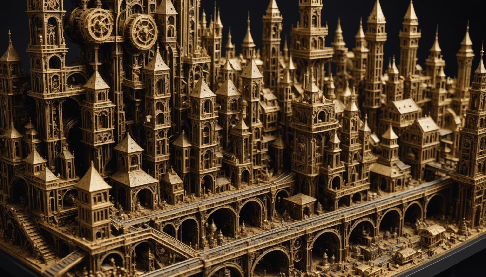

# ghost

A spectral audio visualizer built with [Godot](https://godotengine.org/) 4.6 - _spectral_ both ways: it draws from the audio **spectrum**, and the things it conjures (drifting fog, falling snow, fireflies, auroras) haunt the frame like apparitions. Point it at a song and it draws geometry in response to the sound - rings, planes, harmonics, lattices, weather, whatever - then loops through scenes like a video you can record full-screen.

It is the same move as the Arena and business-card generators elsewhere in this repo, pushed at audio: a **scene definition** (a typed bag of parameters) passed through **typed transformations** modulated by audio features - amplitude, per-band energy, beat, velocity. Procedural, deterministic, and cheap. No generative AI in the render path, anywhere - not in the visuals, not in the voice.

Standalone: it does not import or depend on Praxis.

**This README carries the philosophy and the map. The reference documentation is generated from the source** (doc comments, registries, the scene roster) into [docs/index.md](docs/index.md) - every script, scene, layer, force, actor, verb, Masking effect, and CLI flag. Regenerate with `python docs.py`; it also warns about drift, so it cannot quietly go stale.

## Four instruments

The splash lists all four, always. A mode button _is_ start.

| Mode | Consumes | What it does |
| --- | --- | --- |
| **Auto** | a song | The seeded show. The Director picks scenes by novelty and cuts on the music. |
| **Manual** | a song + a storyboard | Your authored sequence, described as data (`storyboards/*.yaml`), endless and re-converging. |
| **Synthesis** | a written script | ghost speaks it in a synthesized voice, and the show reacts to the narration. |
| **Masking** | a video clip, a file path, or a YouTube URL | A chroma-key effects editor over footage: 18 effects, markers on a timeline, render to video. |

Every mode carries the same **furniture** (`Chrome`): the ⤓ export button and its background render pipeline, the `` ` `` feedback console, the assistant browser, and the `>_` log console (a live tail of Godot's own log, for anyone running without a terminal). That is deliberate - modes hand-assembling their own overlays is how Synthesis shipped twice without feedback or export. New shared furniture goes in `chrome.gd`, never in a mode's branch of `main.gd`.

## Why

Generating visuals for a song with an image or video model is slow and expensive. A procedural visualizer is free, runs in real time, and is infinitely customizable.

The show is **spectrally deterministic**: the session seed derives from the audio's own fingerprint, so the _same song always produces the same imagery_ - the visuals are a function of the sound, not a fresh random roll. `--seed N` overrides it (the exporter passes it so a render reproduces a session, and it is how you deliberately roll a _different_ show for the same song).

## The idea: cattle, not pets

Most 3D work treats each object as a **pet**: you hand-model _this_ eye, _this_ rock - name it, tune it, love it. It doesn't scale and it never surprises you. ghost is built the other way - **cattle**: an object is a _recipe_ of layered primitives whose parameters are **sampled from adjustable ranges**, so every instance is a fresh, naturally-occurring variation.

The discipline, taken to its limit: **every tunable constant is a candidate for sampling.** Wherever a number could be perturbed and the geometry, animation, or shading would still read right, it should be drawn from an intelligent range (per instance, around a sensible centre) rather than baked as one value.

Take **the eye** (`EyeBody`). A pet eye is a bespoke mesh. But an eye is _really_ a few primitives stacked: a **sphere** for the ball, a thin pliable **lens** across the front, a recessed **iris** cap, a **pupil** hole, plus colours, gloss, and a light. Model _those layers_ and _sample their ranges_ - iris hue, pupil dilation, corneal curvature, how restless the gaze is - and you don't get one eye, you get the _space of all eyes_. The same move is already in `rocks` (a material sampled per rock, a reveal threshold sampled across a spectrum) and `bloom` (a whole family of shapes from a handful of superformula numbers). The same idea runs through the voice, where a speaker is a sampled `Voice.Spec` rather than a recording.

## Driving the show

1. **Auto** - the autopilot. The session seed rolls the whole show; the Director picks scenes by novelty and cuts on the music.
2. **Manual** - a **storyboard**. You author the sequence, cues, cast and choreography as data: actors from a registry (3 kinds), verbs on a timeline (22), every number a sampleable range, live bodies carried across the cuts. Every scene _described_, not coded. See [storyboards/README.md](storyboards/README.md) for the spec and [docs/stage.md](docs/stage.md) for the registries.
3. **Semi-automatic** _(the one to be excited about; first rung shipped)_. Start from the **same autopilot seed**, then reach in and pull levers that steer the modulation, live. Not keyframing - _steering a living system_. The first instrument is the **Dial** (bottom-right of the Workspace): turning it injects energy into seeded modulation **deposits**, each surging briefly then decaying into a smaller **standing pattern** the scene keeps, so turning is purely additive over a session. One revolution passes through 5 or 6 **wedges**, each with its own seeded signature (which channels it bends - size, hue, tempo, drive, drift - at what frequencies and waveforms); crossing into the next revolution re-rolls the vocabulary. What a dial does is deliberately arbitrary but **deterministic per song**, so the same gesture on the same song answers the same way. `--dial-demo` turns it hands-free for renders.

A manual session is **endless**: the audio loops in place and the show stays up, the Dial's deposits carrying across the loop. The sequence realigns by _knowing the content itself_ - `Echo` matches the live harmonic signature against a map spanning exactly one hearing, so the arc rolls over with the song and the same sections replay the same scenes, even through cut-up or doubled tracks.

## Synthesis: a voice, and a game to find it

Write or paste a script, and ghost narrates it - **no generative AI and no recordings**. `Voice` is Klatt-lineage source-filter synthesis, all in-house: a glottal source (Rosenberg pulse plus aspiration noise) through a cascade of formant resonators whose targets come from `Phonemes`, EMA-smoothed across segments so coarticulation falls out, with Fujisaki-style prosody (declination, accent bumps on stressed syllables). Pronunciation is co-owned: the letter-to-sound rules are deliberately 1980s technology and will miss rare words, so any word can be written phonetically inline as `[K AE T]`.

- **`VoiceStream`** synthesizes on a worker thread and pushes PCM ahead of the playhead, so a heavy scene dropping frames cannot break the speech. It is a live instrument: `retune` swaps the voice mid-sentence (timbre bends _while_ it speaks) and `restart` replaces the content in place.
- **`Subtitles`** are karaoke, session-owned: the cursor is a narrator's eye rather than a metronome - it ramps when the words run ahead, drifts when close, and rests at pauses. Timing comes from a sidecar JSON written next to each take, so the same overlay works in a live session, a plain `--audio` boot, and the export render.
- **Finding a voice is a fishing trip.** A **throw** speaks a new candidate into the deep; its planned strikes (echo, stretch, pitch, hesitation) are the **bites**, each opening a detection window that decays - catch quickly and the odds are strong. **Pull** sets the hook, then the **reel** anneals the candidate toward and against your party before it freezes, and you **accept** or **release**. A catch presents a **card**: the seed drawn as a constellation, its colour attuned to how near the candidate sits to the party's centre. Accepting folds it into the belt and re-attunes every member. The game is integration - reading the colour shifts, knowing when to hold and when to fold. Drift is a journey, not a clock: an odometer accelerates the longer the line is out (with warp streaks past the raw maximum), and reeling hauls it home in log-time. Reward profiles (Drift / Snap / Hunt) shape how throws range and how catches earn; a seasoned belt reels faster. Everything autosaves.
- **Echo a living voice.** The sampler records you reading a fixed passage, **measures** the voice, and throws the recording away - what leaves the panel is ~20 scalars (a trait vector plus a partial prosody genome) that mint a brand-new seed. The synthesized voice stays fully synthetic; the seed just _sits_ where the living voice sits - its pitch, tempo, breathiness, pausing, melodic spread.

Design and falsifiable rungs: [next/voice.md](../../next/voice.md) at the repo root.

## Masking: the video effects editor

A second app surface alongside the visualizer (`--mask-edit <video-or-session>`), for keying effects over footage. The source can be a file or a **YouTube URL** - paste one into the splash's source field and the editor downloads it itself (yt-dlp in a venv ghost bootstraps under `user://ytdlp_venv`), then transcodes it like any local clip.

A session is a stack of **markers** over a source video. A marker is not a free-form dictionary but a fixed-schema scalar **vector**, so a session's marker list is literally a small matrix - the same shape as the harmonic-signature vectors elsewhere in this project, inspectable the same way. **Every marker is one layer**, and layers stack chronologically with their own ramp/damp envelopes: keying a second colour adds to the first instead of silently rewriting it, and the subtractive half is explicit (`restore` for one colour, `clear` for all). Sessions autosave under `masks/`, carry undo/redo and multi-track lanes with per-track trim and shift, and render to video headlessly.

The 18 effects are implemented in [shaders/mask_split.gdshader](shaders/mask_split.gdshader) and keyed volumetrically off the video's own colour: `erase`, `fire`, `freeze`, `smoke`, `restore`, `whisp`, `crystal`, `echo`, `clear`, `snow`, `fur`, `oracle` (echo inverted into premonition), `serpent`, `chimera`, `arealight`, `meta` (the editor's own workspace mirrored into the frame), `clown` (CPU-detected eyes, mouth and face oval driving a liquid paint sim that punches features through a dark guard), and `umbra` (a shadow cast as the wall's own chroma direction, dimmed, under two linked floods). The control panel is data-driven off `EFFECT_CONTROLS`: a slider that does nothing for the selected effect is never shown, down to individual knobs inside a group.

Full data model, the effect and control tables, and the headless marker-insertion tool: [docs/masking.md](docs/masking.md).

## The shape

```
  .wav ──▶ Spectrum ──▶ AudioFeatures ──▶ GhostScene ──▶ screen / video
           (analyzer)    (typed, per-frame)  │  (definition × behavior)
                                  movement ──┤
                                             ▼
                              Director: cut on the music, blend sometimes
```

### The signal path

- **`Spectrum`** (autoload) owns the audio player and the analyzer bus effect, and emits one **`AudioFeatures`** per frame: `energy`, named bands (`bass` … `treble`), a smoothed `beat` pulse, the full `bands` array, `time`, `flux`, and `movement` (how much the spectrum is _changing_, used to time cuts). This is the single typed interface every scene reads; scenes never touch the audio engine.
- **`GhostScene`** is one visualizer. `build_params(rng)` rolls a **definition** from a seeded RNG, `update(features, delta)` modulates it by the audio, and `_draw()` renders it through the scene's **view** (a centred camera: zoom, tilt, rotate, off-centre). Subclass it to add a scene.
- **Motion is its own axis.** _What_ a scene draws is separate from _how it moves_ (a **behavior**): `static` freezes camera and per-element motion so the scene reacts to audio alone, `drift` adds whole-scene camera breathing, `fluid` turns on independent per-element motion. The base provides a **`ModBank`** of slow seeded oscillators pooled into named organic channels and a per-element `wobble(key, i)`.

### Composition, by registry

- **Physics is a registry.** **`Primitives`** holds 8 reusable **force** modules (`gravity`, `spring`, `drag`, `scatter`, `wind`, `pulse`, `orbit`, `wobble`). A scene builds a **`ParticleSystem`** and composes forces by key; the same `scatter` bursts glass, rocks, and embers. See [docs/forces.md](docs/forces.md).
- **Appearance is a registry too** - the integration axis. **`Layer`** holds 21 self-contained visual components (`bed`, `fog`, `snow`, `rain`, `fireflies`, `stars`, `aurora`, `petals`, `dust`, `bubbles`, `embers`, `clouds`, `rays`, `volumetric`, `cosmos`, …) that seed themselves, advance on the audio, and draw onto the scene's canvas via `add_layer` / `update_layers` / `draw_layers(z)`. **This is the integration payoff**: the same `snow` that is a scene on its own also falls over the `cityscape` skyline, stars draw behind the geometry and snow in front, and weather stops being bespoke per-scene code. Layers work in unit-fraction space, so they fill any aspect ratio without baring an edge. See [docs/layers.md](docs/layers.md).
- **Registries make integration free.** A new scene is mostly a parts list.

### Drawing

- **Every scene declares its render kind** - `canvas`, `mesh3d`, `particles`, `swarm`, or `scene3d`. The project carried several rendering mechanisms forward; naming the split is the first step to converging on it, and the kind rides along in every feedback record.
- **The unified 3D path (`scene3d`) is the convergence target.** `Lens3D` is a real positionable perspective camera (so a scene can push in, orbit, and frame in depth - a wide lens up close gives **forced perspective**, the dimensional read a sheared 2D plane only fakes). `Plane3D` is a flat quad genuinely placed in 3D space. `Scene3D` owns the lens and a world of `Mesh3D` bodies and `Plane3D` quads, depth-sorts the lot, and draws it, so bodies and planes occlude each other correctly under one camera. `Mesh3D` itself is a software 3D primitive with surface texture, material, and a gaussian-masked wireframe reveal; `Geo` holds the fracture helpers that shatter the glass.
- **Structure is the bias; motion is bounded variance.** Flat subjects sway about a seeded rest pose rather than spinning, and the camera never rolls or shears flat 2D content. Genuinely 3D bodies are the exception - they rotate, because that is how a solid reveals its volume. **`Activation`** gives each element a seeded threshold and gain through a soft nonlinearity with fast-attack/slow-decay smoothing, so some elements stay rooted while others bloom. And the camera eases toward its target, so every move is gentle.
- **Sound drives colour, not scale.** Pulsing geometry _size_ with amplitude reads as cheap throbbing. Instead `Lighting` moves bright **hotspots** across the frame, flares a global **glow** on beats, and drifts the hue; a scene asks `light.at(pos)` and `light.glow()`.
- **Many items, local rules.** `Swarm` is a scalar field over a grid that evolves by _local_ interaction - growth creeping out from seeds, or pulses diffusing across the lattice. It drives thousands of items without scripting each one (the `metropolis` city grows from one).

### Staying interactive

The engine runs one main loop, so a scene that spends 300 ms of GDScript in a frame blocks clicks for 300 ms. Two pieces fix that structurally rather than by mitigation:

- **`TriBatch`** accumulates every triangle into one vertex/colour/index buffer and submits it with a single call - the 2D twin of a MultiMesh. The heavy scenes were issuing tens of thousands of per-shape draw calls a frame, and _that_, not the geometry count, was the cost.
- **`FrameForge`** moves the geometry build off the main thread: a scene opts in with a static, pure builder that takes a plain-data snapshot and returns packet chunks, `update` ships the snapshot to a worker, and `_draw` submits the finished packet in microseconds. A scene frame can then never block the UI, however heavy its math.

### Scheduling and transitions

- **`Director`** (autoload) holds the registry of `{scene, behavior}` pairs and performs the changes. A scene either **loops** until cut or is a **oneshot** that plays one sequence and reports `finished()`. Once eligible to exit, the Director waits for a spectral **trigger** - usually a **beat**, sometimes a **movement** (section change) or a **lull** - with a maximum-hold backstop, so exits land on the music.
- **Novelty-weighted scheduling.** Uniform random picking clusters; instead each candidate is weighted by how long its kind has gone unshown, so the show spreads across the catalogue and never repeats a kind back to back.
- **Content-aware transitions (typed morphs).** A scene declares the geometry it leaves (`morph_out`) and what it can grow from (`morph_in`). When they match, the Director plays a **morph** and hands over a typed payload, so the transition is _continuous_: the single eye passes its colour, gaze, and size to `two_eyes`, which starts as that exact eye and splits. Mismatched types fall back to a cut, so a bespoke transition can never break.
- **Transition style is a hierarchy**, highest wins: a compatible morph → the storyboard entry's `transition` → the scene's own `transition_style` → the storyboard default → the mode default (manual = cut, auto = a weighted bag of dips and cuts).

### Authoring feedback

"This shape feels wrong" is hard to act on from a note. The `` ` `` console captures the scene on screen - its typed descriptor (name, kind, behavior, shot, seed, params, the audio frame) plus your query _and_ a screenshot - into `feedback/NNNN.{json,png}`. The seed makes it reproducible; the image shows what "wrong" looked like. The assistant panel browses those records and can dispatch fixes.

## Rendering: live and baked

Distinct from the driving modes - this is how frames get produced.

1. **Live (default).** Audio plays through the analyzer bus and scenes react in real time. The window stretches in `canvas_items` mode, so 2D rasterizes at the monitor's native resolution (`F11` is crisp, not an upscale) while the coordinate system scales proportionally.
2. **Baked (for export).** Export asks for a quality (720p·30, 1080p·60, 4K·60), then runs two background processes: a headless `bake_runner` analyzes the song into a spectrum timeline (cached per song), then a Movie Maker render drives the scenes from that timeline instead of the live analyzer - frame-perfect, with synced audio, and unaffected by Movie Maker's offline audio making a live analyzer unreliable. Resolution is set through a transient `override.cfg` because Movie Maker locks its output size at engine startup, before any script runs; it uses `viewport` stretch so frames come from an offscreen buffer (true 4K on a 1080p display) and **shrinks** the window to a small floater rather than minimizing it - a minimized window stops rendering, and Movie Maker then records the last drawn frame over and over. The exporter also repairs the scratch AVI's headers past 4 GiB, where Godot's 32-bit RIFF size fields wrap.

## Layout

<!-- AUTODOC:LAYOUT:BEGIN -->

Top-level layout; the per-script map (every class, one line each) is [docs/index.md](docs/index.md).

- `project.godot` - Godot 4.6 project; autoloads `Boot`, `Spectrum`, `Director`; `scenes/main.tscn` is the entry scene.
- `scenes/` - The Godot entry scene (`main.tscn`). Everything else is code-built.
- `scripts/` - All GDScript. Per-script map in [docs/index.md](docs/index.md); the subsystem groups are described there too.
- `scripts/scenes/` - The visualizer scene catalogue - one class per scene. See [docs/scenes.md](docs/scenes.md).
- `shaders/` - The two GPU surfaces: `flame.gdshader` (fire layer), `mask_split.gdshader` (all Masking effects).
- `storyboards/` - Manual-mode scene scores (YAML; JSON accepted). [storyboards/README.md](storyboards/README.md) is the data spec.
- `masks/` - Saved Masking sessions, one directory per source video (runtime, git-ignored).
- `tests/` - Headless check scripts (`godot --headless --script tests/<x>.gd`).
- `reference/` - Reference imagery scenes were prototyped from.
- `docs/` - Generated documentation. Regenerate with `python docs.py`; do not edit by hand.
- `feedback/` - Feedback console output: `NNNN.json` + `NNNN.png` per report (runtime, git-ignored).
- `audio/` - Drop a `song.wav` here to bundle one (runtime, git-ignored); or use `--audio`.

<!-- AUTODOC:LAYOUT:END -->

## Scenes

Each scene is a small combination of shapes; behavior decides how it moves. The catalogue below is generated from each scene's own doc comment - [docs/scenes.md](docs/scenes.md) carries the full versions, plus each scene's morph types and composed layers.

<!-- AUTODOC:SCENES:BEGIN -->

52 scenes in the auto rotation (55 on disk). One line each - the full catalogue, with every scene's own documentation, is [docs/scenes.md](docs/scenes.md).

_Core catalogue_

- **`bloom`** (canvas, drift, static) - elegant procedural rosette curves (the koch replacement).
- **`cityscape`** (canvas, static) - a skyline of rectangles that grows with the music.
- **`clockwork`** (canvas, drift, static) - meshing gears under forced restraint, dramatic by physics not by clipart.
- **`embers`** (particles, drift) - a drift of sparks that twinkle and flare, each on its own.
- **`filaments`** (canvas, drift, static) - the procedural-growth primitive, showcased.
- **`fog_lights`** (canvas, drift) - soft lights breathing under a drifting cloud cover.
- **`furry`** (canvas, drift, fluid) - dense, thick, long tufts of fur/hair, magnetized rather than random.
- **`gaussian_landscape`** (canvas, drift) - rolling terrain with fog in the valleys.
- **`harmonic_lattice`** (canvas, drift, static) - a grid of cells that breathe with the spectrum.
- **`metropolis`** (swarm, drift) - a city of thousands of blocks growing over a countryside.
- **`planes`** (scene3d, drift, static) - the spectrum as a ring of real planes under a forced-perspective camera.
- **`rocks`** (mesh3d, drift, oneshot seeds) - faceted stones in real 3D, sampled from a small material/geometry spec.
- **`rooted_growth`** (canvas, drift) - crawling roots and tendrils that spread from a seed.
- **`shatter_glass`** (scene3d, drift, oneshot seeds) - a real pane of glass, shattering in true 3D.
- **`spectrum_ring`** (canvas, fluid, static) - the spectrum bent into a circle.
- **`strata`** (canvas, drift) - stacked waveform planes receding into depth.
- **`voxel_blocks`** (canvas, static) - an isometric heightfield equalizer.
- **`wire_solid`** (scene3d, drift) - a translucent polyhedron on the unified 3D path.

_Weather & atmosphere_

- **`aurora`** (canvas, drift) - slow curtains of light over a starlit night.
- **`bubbles`** (canvas, drift) - an underwater drift of rising bubbles in coloured depths.
- **`clouds`** (canvas, drift, static) - REAL 3D cloud masses drifting across the sky, lit by the sun.
- **`fire`** (canvas, drift) - a living flame attuned to the harmonics.
- **`fireflies`** (canvas, drift) - a dusk meadow sparkling with wandering lights.
- **`fog_bank`** (canvas, drift) - rolling coloured fog, light glowing from within.
- **`fog_volume`** (canvas, drift) - REAL 3D fog: a low, wide bank of soft gaussian puffs receding into depth, lit volumetrically (a brighter sunward edge fading into a dim core) and slowly drifting. A genuine haze with simulated dynamics, not a flat 2D wash. `bed` + `volumetric` (fog mode), and depending on the AIR the seed draws: ...
- **`motes`** (canvas, drift) - dust adrift in a shaft of light.
- **`petals`** (canvas, drift) - blossom, leaves or ash drifting down on a soft breeze.
- **`rainfall`** (canvas, drift) - slanting rain over a brooding sky, fog rolling through it.
- **`snowfall`** (canvas, drift) - a quiet field of falling snow over a soft colour bed.
- **`snowflakes`** (canvas, drift) - a field of several dozen crystal dendrites, restored and multiplied.
- **`starfield`** (canvas, drift, static) - a deep night sky, twinkling, with the occasional shooting star.
- **`underwater`** (canvas, drift) - looking up through flowing water: shafts of light from the surface, bubbles rising, a deep blue-green wash. The submerged corner of the weather catalogue.

_Worlds & projections_

- **`projection`** (canvas, drift, static) - a PCA-style density map of a latent geometry, eye-shaped.
- **`spires`** (scene3d, drift) - a fractal metropolis of harmonic spires over a landscape.
- **`terrain`** (scene3d, drift, static) - real 3D landscapes built from the composable `Field` / `Terrain` foundation.
- **`terrain_city`** (scene3d, drift) - blocks rising as a city over real 3D terrain, growing nonlinearly.

_Depth, standing waves_

- **`chladni`** (particles, drift, static) - grains walking to the places a plate is not moving.

_That should be done where it can actually be looked at, which is what --scene is for_

- **`canopy`** (scene3d, drift) - trees growing on real terrain, from taproot to leaf, through one season.
- **`cloth`** (canvas, drift) - a sheet on a line, and the wind deciding how long it stays whole.
- **`contour_map`** (canvas, drift) - the terrain from directly above, as a printed survey sheet.
- **`falling_sand`** (swarm, drift, static) - a world of matter you never draw, only rule.
- **`glyphs`** (canvas, drift) - an invented script, written live, one stroke at a time.
- **`murmuration`** (particles, drift) - thousands of birds deciding together, against a bright sky.
- **`neural_field`** (scene3d, drift) - a layered network in real depth, lit only where the harmony routes.
- **`tidepool`** (canvas, drift, static) - sunlight through a hand's depth of moving water.

_The-point scenes_

- **`eye`** (scene3d, static) - a single human eye in the black void (the-point, scene 1).
- **`eye_prism`** (scene3d, static) - Eye + prism - the right eye becomes its digital self (the-point, scenes 3-5).
- **`prism`** (scene3d, static) - a single living wireframe tetrahedron (from "the-point").
- **`prism_split`** (scene3d, static) - one prism strains, then breaks into two (from "the-point").
- **`prism_swarm`** (scene3d, drift) - the swarm forms, flies the track, splits into a helix, and jumps (the-point, scenes 12-15).
- **`two_eyes`** (scene3d, static) - the single eye split into two (the-point, scene 2).
- **`two_prisms`** (scene3d, static) - the pair, from the drop through specialization (the-point, scenes 6-11).

<!-- AUTODOC:SCENES:END -->

### Provenance: `spires`

<p align="center"></p>

Prototyped from the photograph above: procedural generation reading a real building's geometry, harmonics, and periodicity - the recursive tiering, the repeating turret motif, the way height and ornament scale together - turning what one photograph fixed in an instant into a generative rule that produces endless variations, driven by whatever song is playing.

### The "the-point" arc

The `eye → two_eyes → eye_prism → two_prisms → prism_swarm` scenes come from a planned video: a continuous 33-second arc of an eye becoming its digital self, coming alive, then a swarm. Consecutive scenes hand their **live bodies** across the cut through a content-aware morph, so an eye or a prism literally continues instead of being re-created. Those bespoke files now serve the auto catalogue only - the default storyboard plays the same arc, all fifteen beats of the brief, as data-driven `stage` entries.

## Running it

Open `project.godot` in Godot 4.6 and press play, or from the command line:

```
godot --path axis/ghost                            # the splash: import a song, pick a mode
godot --path axis/ghost -- --audio ~/track.wav     # skip the splash, boot straight in
godot --path axis/ghost -- --storyboard default    # manual mode: storyboards/default.yaml
godot --path axis/ghost -- --scene planes          # pin one scene for authoring
godot --path axis/ghost -- --synth script.txt      # synthesis: write/paste a script, ghost speaks it
godot --path axis/ghost -- --mask-edit clip.mp4    # masking: the video effects editor
godot --path axis/ghost -- --no-splash             # auto mode, bundled/no audio
```

Any of `--audio` / `--scene` / `--storyboard` / `--synth` / `--mask-edit` / `--no-splash` boots straight past the splash. `--audio` accepts `.wav`, `.mp3`, `.ogg`, and `.flac` (FLAC has no runtime loader in Godot, so it is transcoded via `ffmpeg`, which must be on `PATH`). Every flag, including the internal ones the exporter and bake runner pass between processes: [docs/cli.md](docs/cli.md).

Controls: `Space` next scene · `F11` full-screen · `` ` `` feedback · `>_` log console · `Esc` quit.

If no audio is found it still runs - scenes animate on an idle clock with zeroed features, so a scene can be developed with no song loaded.

## Adding a scene

```gdscript
extends GhostScene

func build_params(rng: RandomNumberGenerator) -> Dictionary:
    return { "count": rng.randi_range(6, 24), "hue": rng.randf() }

func update(f: AudioFeatures, delta: float) -> void:
    tick(f, delta)            # advance organic motion (speed-scaled by behavior)
    drift_view(f)             # optional whole-scene camera drift (gated by behavior)
    queue_redraw()

func _draw() -> void:
    begin_draw()              # push the view transform; draw around (0,0) = center
    for i in int(params.count):
        var p := Vector2(0, -200 + i * 20)
        p += Vector2(wobble("dot", i), 0) * 40   # per-element drift (fluid only)
        draw_circle(p, 6, Color.from_hsv(params.hue, 0.7, 1.0))
```

Then add `{"script": preload("res://scripts/scenes/my_scene.gd"), "behavior": "fluid"}` to `Director.SCENES` - list it more than once with different behaviors to keep several looks. For a oneshot, set `lifecycle = "oneshot"` in `build_params` and return `true` from `finished()`. The contract: a seeded definition, modulated by audio, moved by a behavior, with a lifecycle, drawn through a view.

To compose **weather and atmosphere**, add layers and drive them from update/`_draw` - the appearance equivalent of composing forces:

```gdscript
func build_params(rng):
    framing = "field"
    add_layer("bed", rng, {"hue": 0.6})      # colour wash behind everything
    add_layer("snow", rng, {"count": 100})   # falling flakes over it
    return {}

func update(f, delta):
    tick(f, delta); update_layers(f, delta); queue_redraw()

func _draw():
    begin_draw(); draw_layers()               # or draw_layers("back") ... geometry ... draw_layers("front")
```

Set `render_kind` in `build_params` so the scene is typed (`canvas` is the default). For a 3D scene, **extend `Scene3D` instead of `GhostScene`**: it gives you a `lens`, `add_body(...)` / `add_plane(...)`, and a depth-sorted `render_world()` - so you build in real 3D space and fly the camera rather than shearing 2D. See `snowfall.gd` and `cityscape.gd` for layers, `planes.gd` and `wire_solid.gd` for 3D.

## Toward a complete package: modeling the physical sciences

The long arc is simple to state and enormous to fill: **ghost should be able to model anything physical.** Every scene is a recipe of sampled primitives; the goal is to keep growing the primitive kit until the catalogue spans the natural world, so that pointing it at a song can summon _any_ phenomenon, alone or in combination. Most rows below reuse primitives that already exist (`Mesh3D`, `Swarm`, `Filament`, `Flow2D`, `Lighting`, `Lens3D`, the force registry); the work is composing them and lifting their numbers into sampled ranges.

- **Weather & atmosphere** - snow, rain, fog, fireflies, stars, aurora, petals, bubbles, dust, clouds (shipped as `Layer` components and scenes), with precipitation DENSITY now driven by the music rather than fixed at build; still open: wind streaks, hail, heat shimmer, a lightning storm.
- **Light & shadow** - a positioned, moving light casting real shadows; day/night sweeps; god rays through fog; caustics; refraction through the glass and prism. Beyond `Lighting`'s 2D hotspots toward true occlusion.
- **Crystals & symmetry** - snowflakes (shipped, as a sampled `Crystal` bank over the Nakaya habits: plates, dendrites, needles, columns, bullets, riming) and the 17 plane symmetry groups (`WallpaperGroup`); still open: mineral lattices, growth by accretion.
- **Geology & terrain** - heightfields from the `Field`/`Terrain` foundation (shipped); still open: erosion, rivers, plate motion, volcanoes. Terrain as the stage other scenes stand on.
- **Structures & cities** - a `Swarm` city growing on real terrain (shipped); still open: bridges, lattice frameworks, ruins, roads and districts.
- **Botany & growth** - trees and branching in real 3D on real terrain (shipped: `Branch3D` + `canopy`); still open: vines, flowers, undergrowth.
- **Fluids** - water surfaces, waves and caustics (shipped: `WaveField` + `tidepool`), liquids that pour and pool (`Grains`), curl-noise flow (`Flow2D`); still open: smoke, whirlpools.
- **Celestial & orbital** - planetary systems and n-body gravity, moons and rings, galaxies, comets, constellations.
- **Particle physics & mechanics** - cloth as a tearing Verlet sheet (shipped: `cloth`), granular collision and repose (`Grains`), shattering (`Geo`); still open: springs and chains, harmonographs, explosions.
- **Biology & emergence** - flocking with a spatial hash (shipped: `Boids` + `murmuration`); still open: cells and tissues, reaction-diffusion, predator-prey, ant trails, slime molds.
- **Waves & fields** - standing waves and nodal figures on a driven plate (shipped: `PlateField` + `chladni`, where the audio is the literal physical input rather than a modulator); still open: EM and gravitational fields, interference.
- **Chemistry & matter** - molecules and bonds, crystallization, phase changes, diffusion, combustion.

Filling any one row is a scene; filling the map is the package. The unifying mechanism is the scene-spec pipeline below.

## Where it's going

**Open:**

- **Scene-spec pipeline** (the north star, "cattle, not pets"): a declarative spec that _samples a configuration_ of geometry families, modifiers, materials, motion, and lighting and composes them, so lifelike scenes emerge from integrating many domains in adjustable ranges rather than from hand-written code. `rocks` and `bloom` already sample small specs, and the storyboard `stage` spec is this pipeline at the choreography level; the remaining work is pushing the same spec DOWN into the bodies' own geometry and material numbers - the `eye`'s hand-tuned constants first.
- **Semi-automatic mode, continued**: more dials (each a unique signature), dial reach into auto-mode scenes and layers, and surfacing the scene-spec's sampled parameters as addressable controls.
- **Sample every tunable, everywhere** (a standing principle, not one task): every constant a candidate for sampled expression.
- **Unified renderer, continued**: migrate the remaining 2D scenes onto `Scene3D` and route everything through one modulation surface, so any scene renders under one set of camera and light controls.
- **Spectral determinism, phase 2**: a perceptual fingerprint robust to re-encodes, so _like-sounding_ audio maps to the same imagery. `Echo` already keeps a manual session's cursor honest against the content; deriving the session _seed_ perceptually is the remaining half.
- **Light crossing terrain**: a moving light sweeping a rolling landscape and casting travelling shadows - true occlusion under `Lens3D`.
- **Terrain & city specs**: texture as modulation everywhere (reuse `Field` beyond terrain), erosion and rivers, vegetation scatter by slope and mask, roads and districts along low-curvature contours, detached districts with real physics, Gouraud shading with a moving sun, and weather layers composed onto terrain.
- **Procedural geometry kit**: extend `warp`/`facet` toward terrain, trees, and crystals feeding the `scene3d` world.
- **More `Swarm` rules**: pheromone trails, reaction-diffusion, predator-prey, and abstract (non-city) many-item scenes.
- **The manual editor**: per-entry params, reordering, a timeline, and save, grown into the Workspace.
- Stronger beat, onset, and tempo tracking; exits that snap to bars, not just beats.
- Photoreal stone (texture, roughness, height relief) to pair with the wireframe reveal.
- Definition / behavior / lifecycle presets per song, config-driven like the other generators.

**Shipped:**

- The framework: live analyzer → `AudioFeatures` → scenes, with behaviors, lifecycles, spectral exit triggers, render-kind typing, and typed morph transitions.
- The two composition registries - `Primitives` (forces) and `Layer` (appearance) - plus `Particle`/`ParticleSystem`, and the nonlinear/organic kit (`Nonlinear`, `Flow2D`, `Filament`, `Swarm`).
- Real 3D: `Mesh3D` software bodies with texture/material/hybrid warping and the gaussian wireframe reveal, `Geo` fracture, and the forced-perspective `Lens3D` / `Scene3D` / `Plane3D` path.
- The `Field` / `Palette` / `Terrain` foundation, and a city that grows across real terrain oriented to its normals.
- Novelty-weighted scheduling and spectral determinism phase 1 (fingerprint plus a `SEED_SALT` that re-rolls the whole show for a fixed song without touching the audio).
- Manual mode: the storyboard data spec (cast, track, verbs, `defs`/`use`, musical cue gates, a `tail:` that keeps a finished arc alive, an `elastic` clock that breathes with the song), the splash, and the Workspace.
- Semi-automatic, first rung: the **Dial**, and `Echo` re-localization keeping an endless session aligned to the content.
- **Synthesis**: `Phonemes` + `Voice` + threaded `VoiceStream`, karaoke `Subtitles`, the fishing-game editor, and the microphone sampler that mints a seed from a living voice.
- **Masking**: the marker/layer data model, 18 effects, multi-track lanes, YouTube import, and headless render.
- Video export via an offline `SpectrumBake`, and the shared `Chrome` furniture (export, feedback, assistant, log console) every mode inherits.
- Interactivity under load: `TriBatch` batched drawing and off-thread geometry via `FrameForge`.
- **Simulation as a scene kind**: `SimClock`, the fixed-rate tick accumulator every running system advances on. Not a convenience - the Director pre-warms each scene with a dozen `update()` calls before its first frame and can sub-step fifteen times in one frame, so a system that advanced per call would be finished before it was seen.
- **The bookend**: held silence before the first sound and after the last, on one continuous session clock, with picture and sound fading together. In Synthesis the silence is written into the take's own PCM so the ambience bed swells through the intro and the analyzer hears it; elsewhere playback is simply held.
- **Pronunciation as data**: a `names:` block for invented words and proper nouns that outranks the neural backend, a context-sensitive homograph table, Markdown stripped before it can be spoken aloud, and `tests/pronounce_audit.gd` - which reads a script and reports every uncertain word BEFORE it is rendered, rather than after it is heard.
- **Homographs by part of speech, with no pronunciation table**: eSpeak already knows both readings of `read` and picks between them from syntax, but ghost phonemizes word by word (it needs per-word boundaries for the karaoke line) and a word alone has no syntax. So `voice_host/homographs.py` tags the sentence and asks eSpeak the SAME question again inside a carrier phrase that forces that part of speech - "they have read them" - and takes the answer. Nothing is substituted from a dictionary, because a dictionary's readings are not this model's: translating a published homograph list through ghost's ARPAbet disagreed with eSpeak on 223 of 371 words.
- **The gates**: a whole-catalogue smoke probe that builds, updates, renders and frees every registered scene at several seeds, plus checks for the bookend clock, the weather's dynamic range, the pad-led intro, and pronunciation.

## Status

Working framework, live path end to end, in four modes. Geometry, motion, lifecycle, exit cue, render kind, and transitions are independent typed axes; physics and appearance are composable registries; there is a real forced-perspective 3D path the 2D scenes are migrating onto; bodies are built from sampled primitives rather than hand-modelled; the voice is synthesized from first principles; and any session renders to video through an offline bake.

The throughline is the **scene-spec pipeline**: keep growing complementary, sampleable primitive domains and let them integrate themselves, so scenes occur naturally rather than being hand-built. That pipeline is also what unlocks the **semi-automatic** mode - the autopilot seed plus live dials steering the modulation.
